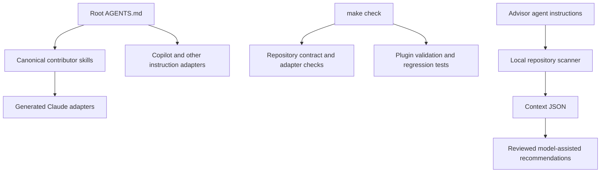

# COPS architecture

COPS distributes security-focused plugins, specialist agents, and reusable skills
for general cybersecurity assistance. It separates repository maintenance from
these product capabilities.
The portable repository foundation is adapted from PARK; the first product is
COPS Security Logging Advisor.

`scripts/agent/` owns the contributor gate; it does not change plugin behavior.
`.agents/skills/` holds maintenance workflows. The plugin's two product skills,
scanner, manifests and report assets stay in `security-logging-advisor/`.
`specs/` and `.specify/` preserve the project's specification-driven workflow.

`soc-investigation-workbench/` contains a separate local case engine and two
planning/review skills. It records analyst-supplied evidence associations and
ranks dependent questions within case budgets. Hunt design, KQL, telemetry joins,
and qualification remain owned by Sentinel; guarded handoffs require an unchanged,
hash-locked vendor snapshot. The canonical skills/catalog are still pending, so
the planner is usable locally while query handoffs fail closed. See its
[ownership boundary](soc-investigation-workbench/docs/ownership.md).

See [repository layout](docs/REPOSITORY_LAYOUT.md),
[plugin architecture](security-logging-advisor/docs/architecture.md), and the
[adoption decision](docs/decisions/0001-park-adoption.md).
