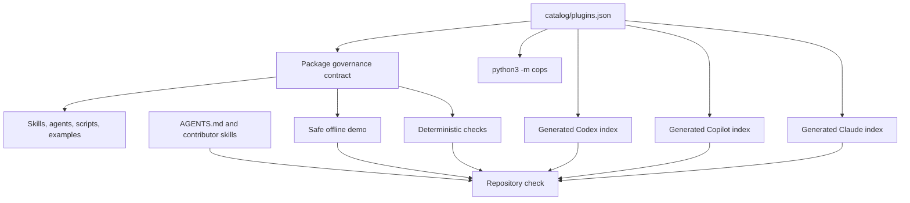

# COPS architecture

COPS is a catalog-driven collection of self-contained cybersecurity packages. It
separates product capabilities from repository-maintenance workflows and separates
offline evidence from host and live-service claims.

## Canonical contracts

`catalog/plugins.json` owns package identity, version, category, location, and
tags. Each package's `package.json` owns maturity, limitations, evidence states,
safe demo, and validation commands. The `cops` module validates both, constrains
command execution to package-owned Python scripts with timeouts and no shell, and
generates all host marketplace indexes. Each package keeps distinct Copilot,
Codex, and Claude manifests because their metadata contracts are not
interchangeable.

Product assets remain under `plugins/<category>/<plugin-id>/`. This category-first
layout keeps a growing catalog browsable while preserving each package as a unit
that can be reviewed or distributed independently.

## Included product boundaries

- Security Logging Advisor collects local repository signals and guides reviewed
  logging recommendations.
- SOC Investigation Workbench plans bounded investigations from analyst-supplied,
  redacted evidence; it does not execute queries or response actions.
- Sentinel Hunt Workbench owns hunt content, profiles, rendering, deterministic
  reference evaluation, and generated platform adapters. Its offline suite does not
  emulate Kusto or prove Microsoft Sentinel tenant behavior.

SOC-to-Sentinel handoff remains a guarded cross-package integration. The existence
of both packages does not by itself validate the handoff or a live query path.

## Contributor architecture

`AGENTS.md`, `.agents/skills/`, `scripts/agent/`, and the `Makefile` own repository
maintenance. Generated `.claude/skills/` and thin instruction adapters point back
to that canonical policy. Specifications and pytest-bdd scenarios define
observable acceptance criteria. The complete gate combines repository contracts,
adapter drift, package checks, and behavior tests.

See [Getting Started](docs/GETTING_STARTED.md),
[Repository Layout](docs/REPOSITORY_LAYOUT.md), and
[Adding a Plugin](docs/ADDING_A_PLUGIN.md).
