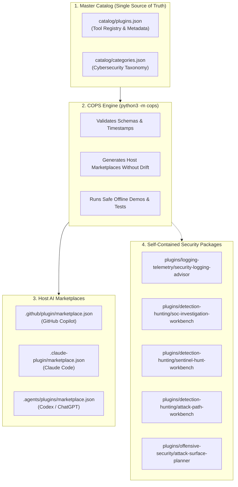

# System Architecture of COPS

Welcome to the architectural overview of **COPS (Copilot Operations Plugins for Security)**!

At its core, COPS solves a fundamental challenge in modern AI-assisted engineering: **How do we build production-grade, defensive cybersecurity tools that work seamlessly across multiple AI assistants without duplicating code or creating vendor lock-in?**

To answer this, COPS uses a **catalog-driven, offline-first architecture** where each security capability is completely self-contained, and configuration files for specific hosts (like GitHub Copilot, Claude Code, and Codex) are automatically generated from a single canonical registry.

```mermaid
flowchart TD
    subgraph MasterCatalog["1. Master Catalog (Single Source of Truth)"]
        A["catalog/plugins.json<br/>(Tool Registry & Metadata)"]
        B["catalog/categories.json<br/>(Cybersecurity Taxonomy)"]
    end

    subgraph Engine["2. COPS Engine (python3 -m cops)"]
        E1["Validates Schemas & Timestamps"]
        E2["Generates Host Marketplaces Without Drift"]
        E3["Runs Safe Offline Demos & Tests"]
    end

    subgraph HostMarketplaces["3. Host AI Marketplaces"]
        G1[".github/plugin/marketplace.json<br/>(GitHub Copilot)"]
        G2[".claude-plugin/marketplace.json<br/>(Claude Code)"]
        G3[".agents/plugins/marketplace.json<br/>(Codex / ChatGPT)"]
    end

    subgraph Plugins["4. Self-Contained Security Packages"]
        P1["plugins/logging-telemetry/security-logging-advisor"]
        P2["plugins/detection-hunting/soc-investigation-workbench"]
        P3["plugins/detection-hunting/sentinel-hunt-workbench"]
        P4["plugins/detection-hunting/attack-path-workbench"]
        P5["plugins/offensive-security/attack-surface-planner"]
    end

    MasterCatalog --> Engine
    Engine --> HostMarketplaces
    Engine -.-> Plugins
```

---

## The Four Core Architectural Pillars

### 1. The Master Catalog (`catalog/`)
Instead of each AI assistant maintaining its own separate list of plugins, COPS maintains **one canonical inventory**:
- **`catalog/plugins.json`**: Records every plugin's unique ID, display name, semantic version, primary category, and feature tags.
- **`catalog/categories.json`**: Defines our stable cybersecurity taxonomy (`logging-telemetry`, `detection-hunting`, `offensive-security`). Every package is assigned exactly one primary category to keep the repository well-organized as it grows.
- **`catalog/schemas/`**: Strict JSON schemas defining what a valid package, finding, or evidence record looks like.

### 2. The Universal Host Adapter Engine (`cops`)
Different AI assistants expect different directory structures and configuration keys:
- **GitHub Copilot** uses `.github/plugin/marketplace.json` and root `plugin.json` files conforming to the Agent Plugins standard.
- **Claude Code** expects `.claude-plugin/marketplace.json` and `.claude-plugin/plugin.json`.
- **Codex / ChatGPT** requires `.agents/plugins/marketplace.json` and `.codex-plugin/plugin.json` with declared interface capabilities.

Rather than hand-editing three different files every time a plugin changes, `python3 -m cops generate` reads the master catalog and **automatically builds all three marketplace indexes**. Our CI test suites verify that generated files never drift out of sync with the master catalog.

### 3. Self-Contained Packages (`plugins/<category>/<plugin-id>`)
Every security tool in COPS is completely modular and lives in its own dedicated directory:
- **Zero Third-Party Runtime Dependencies**: Core plugin scripts run using only the standard Python library (`json`, `re`, `pathlib`, `urllib`).
- **Complete Package Boundary**: Each package owns its skills, scripts, test cases, and practitioner playbooks. A developer can inspect or test one package without needing to understand the rest of the repository.
- **Built-in Safe Demos**: Every package declares a safe demonstration command that executes with synthetic data in a matter of seconds.

### 4. Deterministic Verification & Evidence Boundaries
Security tools require trust. We separate what is verified locally from what remains unverified in a live environment:
- **Local Validation (`validated`)**: The package's scripts parse, schemas pass validation, and deterministic tests catch known attack simulations.
- **Live Integration (`unverified`)**: The package has not been granted live cloud credentials, and no external tenant API was called.
This separation ensures operators know exactly what has been proven locally versus what requires staging validation in a live cloud tenant.

---

## Package Responsibilities at a Glance

1. **Security Logging Advisor** (`logging-telemetry`): Inspects local repositories to identify missing audit events, flags sensitive variable leakage, and verifies CVE call-path reachability.
2. **SOC Investigation Workbench** (`detection-hunting`): Models competing hypotheses and inquiry dependency graphs to guide analysts through complex alert triage without confirmation bias.
3. **Sentinel Hunt Workbench** (`detection-hunting`): Develops, adapts, and stress-tests 12 defensive threat-hunting workflows across Microsoft Sentinel, Defender XDR, and Data Lake.
4. **Attack Path Workbench** (`detection-hunting`): Evaluates multi-hop identity and permission graphs from local cloud exports to identify critical lateral movement choke points.
5. **Attack Surface Planner** (`offensive-security`): Translates human-signed rules-of-engagement scopes and local exports into passive, bounded review plans.

---

## Shared Evidence SDK (`cops.evidence`, `cops.connectors`)

For tools that need to collect or store evidence from cloud APIs (such as Azure Resource Graph or Microsoft Graph), the repository includes an opt-in **Evidence SDK**:
- **Tamper-Evident Envelopes**: Evidence items are wrapped with SHA-256 content hashes, collection timestamps, and query fingerprints.
- **Bounded Connectors**: Built-in limits on maximum response size, pagination limits, and request timeouts prevent runaway API costs or memory exhaustion.
- **Transaction Checkpoints**: Supports resumable state and interruption recovery during long-running collection jobs.

See the **[Shared Evidence SDK Guide](docs/EVIDENCE_SDK.md)** for detailed implementation examples.

---

## Contributor & Quality Assurance Spine

The repository maintains strict quality guardrails:
- **`AGENTS.md`**: Canonical instructions for contributors and automated agents.
- **`Makefile` & `scripts/agent/check.py`**: Runs pre-commit validation, including syntax checks, contract verification, adapter synchronization, and pytest-bdd scenarios.
- **`make check`**: The universal gate that must pass before any change is merged.

To get started with development, explore the **[Contributing Guide](CONTRIBUTING.md)** and **[Repository Layout](docs/REPOSITORY_LAYOUT.md)**.
