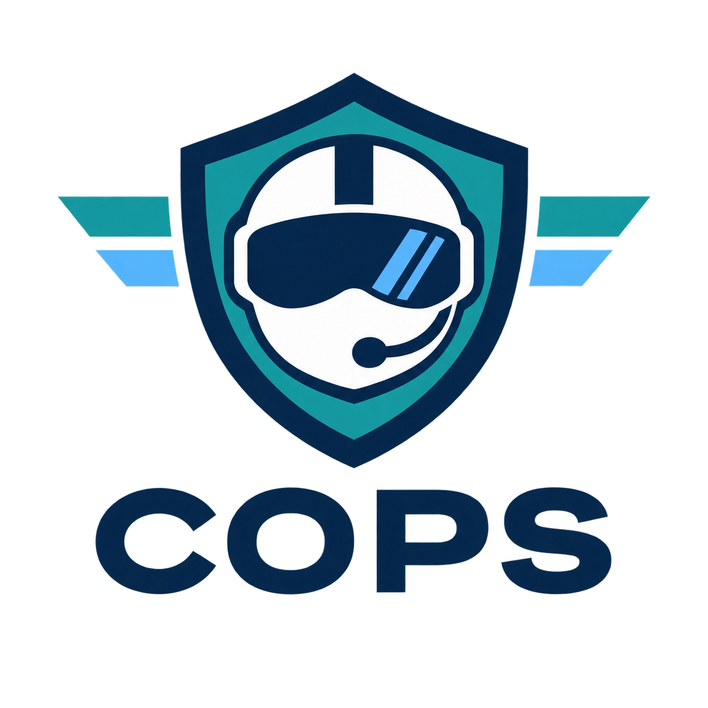

# COPS — Copilot Operations Plugins for Security

<p align="center">
  
</p>

COPS is a portable catalog of defensive cybersecurity plugins, agents, skills,
and deterministic local tools. A security engineer can use the repository without
first learning any host-specific packaging format: the catalog says what is
available, each package declares its own safe demo and checks, and generated host
indexes all come from that single source.

## Five-minute analyst path

Requirements: Python 3.11 or newer. These commands use only the Python standard
library and do not install dependencies, access a tenant, or require network access.

```bash
git clone https://github.com/sodejm/copilot-operation-plugin-for-security.git
cd copilot-operation-plugin-for-security
python3 -m cops doctor
python3 -m cops list
python3 -m cops info sentinel-hunt-workbench
python3 -m cops demo sentinel-hunt-workbench
python3 -m cops check sentinel-hunt-workbench
```

`list` shows maturity plus separate offline, host-installation, and live-integration
states. `demo` runs a bounded package-owned example. `check` runs that package's
declared deterministic validation. None of these commands claim that a plugin is
installed in a particular assistant or that a live security service was exercised.

## Included packages

| Package | Use it for | Safe first command |
| --- | --- | --- |
| Security Logging Advisor | Collect repository signals and plan cost-aware, privacy-aware security logging | `python3 -m cops demo security-logging-advisor` |
| SOC Investigation Workbench | Validate evidence associations and plan bounded investigations without running response actions | `python3 -m cops demo soc-investigation-workbench` |
| Sentinel Hunt Workbench | Explain, render, and stress-test 12 defensive hunting workflows offline | `python3 -m cops demo sentinel-hunt-workbench` |
| Attack Path Workbench | Trace conditional paths in illustrative local exports with evidence-linked reports | `python3 -m cops demo attack-path-workbench` |

For the complete analyst walkthrough, command reference, and evidence boundaries,
read [Getting Started](docs/GETTING_STARTED.md). Package-specific instructions live
with each package under `plugins/<category>/<plugin-id>/`.

## How portability works

- `catalog/plugins.json` is the canonical inventory.
- Every package owns a `package.json` runtime/evidence contract, an Agent
  Plugins v1.0.0 root `plugin.json`, native Codex and Claude manifests, skills,
  documentation, a safe demo, and deterministic checks.
- `python3 scripts/agent/export_portable.py --output dist/agent-plugins` creates
  separate host-neutral packages. The source packages keep their Claude Code
  manifests for native marketplace discovery.
- `python3 scripts/agent/install_prerequisites.py --check` reports missing
  declared tools. `--dry-run` previews installation, and `--install` explicitly
  invokes a supported package manager. Current packages require no external tools.
- `python3 -m cops ...` is the host-neutral operator interface.
- `.agents/plugins/marketplace.json`, `.github/plugin/marketplace.json`, and
  `.claude-plugin/marketplace.json` are generated indexes, not independent sources.
- Validation rejects uncataloged packages, misplaced packages, duplicate skill
  names, unsafe command paths, invalid v1 manifests and prerequisite declarations,
  stale generated indexes, and unsupported support claims. `make check` also
  builds and inspects every portable export and runs the acceptance tests.

See [Architecture](ARCHITECTURE.md), [Repository Layout](docs/REPOSITORY_LAYOUT.md),
and [Compatibility](docs/COMPATIBILITY.md) for the full boundaries.

## Contributor path

```bash
python3 -m venv .venv
source .venv/bin/activate
python3 -m pip install -r requirements.txt
python3 -m cops doctor --contributor
make check
```

On Windows, activate `.venv\Scripts\Activate.ps1` in PowerShell. If Make is not
available, run `python3 scripts/agent/check.py`. Before adding a capability, read
[Adding a Plugin](docs/ADDING_A_PLUGIN.md), [AGENTS.md](AGENTS.md), and
[CONTRIBUTING.md](CONTRIBUTING.md).

## Evidence and safety

Offline validation proves only what its output states. Pattern matching is not a
security or compliance guarantee. Static manifests do not prove host discovery or
activation. Fixture-backed tests do not prove tenant schema, permissions, latency,
cost, or false-positive behavior. Live and host claims stay `unverified` until a
separate, reviewable evidence record exists.

## License and attribution

Existing COPS project material retains the [PolyForm Noncommercial License 1.0.0](LICENSE).
Imported PARK material retains its Apache-2.0 notices; see
[third-party notices](THIRD_PARTY_NOTICES.md) and [licensing](docs/LICENSING.md).
