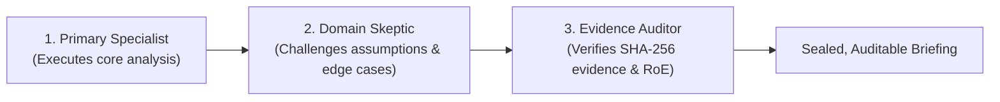

# COPS Specialist Cybersecurity Agent Profiles

Welcome to the centralized catalog of **Specialist Cybersecurity Agent Profiles** for COPS (Copilot Operations Plugins for Security).

In high-maturity cybersecurity organizations, no single analyst or engineer handles every task. Instead, specialized practitioners collaborate through well-defined roles, explicit handoffs, and strict Rules of Engagement (RoE). COPS structures this expertise into **18 callable agent profiles** across five operational domains:

1. **Offensive Security & Adversarial Emulation**: Ethical penetration testing, red team kill-chain modeling, perimeter attack surface planning, and AI prompt injection assessments.
2. **Defensive Operations & Detection Engineering**: Microsoft Sentinel KQL query engineering, hypothesis-driven threat hunting, SOC alert triage, and detection-as-code regression testing.
3. **Incident Response & Digital Forensics**: Blast-radius modeling and sandboxed containment rehearsal, tamper-evident forensic evidence acquisition, and static malware/script triage.
4. **Identity, Exposure & Threat Intelligence**: Cloud IAM/Entra ID entitlement analysis, CVE/SBOM reachability triage, application security code review, and CTI feed correlation.
5. **Governance, Quality & Architecture**: Purple team efficacy measurement, audit telemetry architecture, and GRC compliance control verification.

---

## Autonomous Dynamic Selection & Routing

COPS plugins, skills, and parent orchestrators automatically select the optimal specialist profile using the deterministic zero-token classifier in `cops.routing`:

```bash
# Route any natural language request or security task:
python3 -m cops.routing route "Optimize this Sentinel KQL query for low ingestion cost"
```

The router evaluates incoming intent, entities, and artifact formats to emit an execution plan specifying:
- **Primary Specialist Profile**: The best matched agent for the task.
- **Criticality Level**: `normal` vs. `critical`.
- **Interactive Authorization Gate**: Prompt for human RoE approval on high-impact actions.
- **Triad Assembly**: For critical tasks, automatically constructs a 3-agent team (Primary + Skeptic + Auditor).

---

## The Triad Orchestration Model for Critical Tasks

When a task involves high operational risk (e.g. penetration testing, assumed-breach emulation, live containment actions, or cloud privilege escalation claims), COPS activates the **Triad Orchestration Topology**:



1. **Primary Specialist**: Formulates the hypothesis, drafts the KQL query, plans the attack path, or designs the containment steps.
2. **Domain Skeptic**: Actively challenges the primary specialist's assumptions, tests alternative benign hypotheses, and checks transition prerequisites (mirroring `attack-path-workbench`'s `path-skeptic`).
3. **Evidence & Safety Auditor**: Validates that every assertion is anchored to an immutable cryptographic evidence ID (`evidence-envelope.schema.json`) and verifies that human interactive authorization was granted.

---

## Interactive Authorization Gate

Offensive security and active incident response profiles require explicit authorization before executing. COPS supports both pre-signed JSON manifests and **interactive human authorization**:

```bash
# Verify or interactively authorize a scoped operation:
python3 -m cops.routing authorize --specialist cops-pentest-specialist --scope "10.0.0.0/24" --action "network-config-audit"
```

In interactive environments, the operator is prompted with exact scope, target parameters, and risk disclosures. Upon confirmation, a tamper-evident, SHA-256 hashed `AuthorizationReceipt` is generated, satisfying the gate. In headless CI/CD environments, the gate strictly fails closed unless a pre-signed receipt is passed.

---

## Inventory of 18 Specialist Profiles

| Profile ID | Domain | Criticality | Interactive Auth | Primary Plugin |
| :--- | :--- | :--- | :--- | :--- |
| [`cops-pentest-specialist`](profiles/cops-pentest-specialist.agent.md) | Offensive | Critical | Required | `attack-surface-planner` |
| [`cops-redteam-operator`](profiles/cops-redteam-operator.agent.md) | Offensive | Critical | Required | `attack-path-workbench` |
| [`cops-attack-surface-planner`](profiles/cops-attack-surface-planner.agent.md) | Offensive | Normal | No | `attack-surface-planner` |
| [`cops-ai-adversary-specialist`](profiles/cops-ai-adversary-specialist.agent.md) | Offensive | Normal | No | `foundry-agent-harness` |
| [`cops-sentinel-kql-engineer`](profiles/cops-sentinel-kql-engineer.agent.md) | Defensive | Normal | No | `sentinel-hunt-workbench` |
| [`cops-threat-hunter`](profiles/cops-threat-hunter.agent.md) | Defensive | Normal | No | `sentinel-hunt-workbench` |
| [`cops-soc-analyst`](profiles/cops-soc-analyst.agent.md) | Defensive | Normal | No | `soc-investigation-workbench` |
| [`cops-detection-engineer`](profiles/cops-detection-engineer.agent.md) | Defensive | Normal | No | `detection-quality-workbench` |
| [`cops-incident-responder`](profiles/cops-incident-responder.agent.md) | Incident/DFIR | Critical | Required | `incident-response-sandbox` |
| [`cops-forensic-collector`](profiles/cops-forensic-collector.agent.md) | Incident/DFIR | Normal | No | `telemetry-proof-pack` |
| [`cops-malware-analyst`](profiles/cops-malware-analyst.agent.md) | Incident/DFIR | Normal | No | `soc-investigation-workbench` |
| [`cops-identity-specialist`](profiles/cops-identity-specialist.agent.md) | Identity | Critical | Required | `entra-identity-workbench` |
| [`cops-exposure-analyst`](profiles/cops-exposure-analyst.agent.md) | Identity | Normal | No | `exposure-triage-workbench` |
| [`cops-appsec-engineer`](profiles/cops-appsec-engineer.agent.md) | Identity | Normal | No | `patch-security-review` |
| [`cops-threat-intel-analyst`](profiles/cops-threat-intel-analyst.agent.md) | Identity | Normal | No | `threat-intelligence-enrichment` |
| [`cops-purple-team-coordinator`](profiles/cops-purple-team-coordinator.agent.md) | Governance | Normal | No | `detection-quality-workbench` |
| [`cops-logging-architect`](profiles/cops-logging-architect.agent.md) | Governance | Normal | No | `security-logging-advisor` |
| [`cops-compliance-auditor`](profiles/cops-compliance-auditor.agent.md) | Governance | Normal | No | `security-logging-advisor` |

All profiles adhere strictly to the COPS Script-First Determinism standard: tools and scripts execute heavy data analysis on the host CPU, while agent profiles provide cognitive reasoning, hypothesis testing, and user-facing synthesis.
