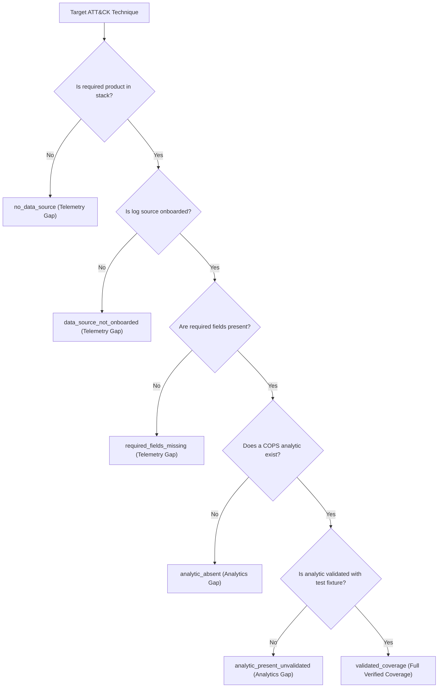

# MITRE ATT&CK & Attack Flow Coverage Guide

This guide explains how COPS maps cybersecurity capabilities to the MITRE ATT&CK® framework and MITRE Attack Flow, how to run telemetry and analytics gap analysis, and how contributors author and validate coverage mappings.

---

## 1. Evidence Boundaries and Philosophy

In COPS, ATT&CK mappings provide **investigative structure and engineering planning evidence**, not proof of security control effectiveness:

- **Absence of alerts is not evidence of absence**: A hunt query or detection rule does not guarantee adversary activity is caught; evasive tradecraft, log filtering, or threshold bypasses may occur.
- **Uncertainty must remain visible**: We explicitly distinguish between **validated analytics** (verified by reproducible offline test fixtures) and **unverified proposals** (draft analytics or speculative queries). Unverified rules are never presented as validated detection.
- **Tenant-safe planning**: Coverage matrices and Attack Flow exports contain schemas, tactics, and synthetic evidence references. They never contain tenant-specific secrets, credentials, or proprietary environment data.

---

## 2. Coverage Roles

Every mapping defines a specific `coverage_role` to prevent confusing log recommendations or triage scripts with automated detection:

| Role | Meaning | Example in COPS |
| :--- | :--- | :--- |
| `detection` | Threat hunting or detection engineering queries identifying adversary behavior in logs. | `sentinel-hunt-workbench` (H01 password spray detection) |
| `investigation` | Workflows that normalize raw evidence, correlate identifiers, and trace entity blast radius. | `soc-investigation-workbench` (intake normalization), `attack-path-workbench` (entitlement reachability) |
| `prevention` | Configuration audits and telemetry recommendations ensuring logging pipelines are active. | `security-logging-advisor` (logging-recommendations) |
| `response` | Case packaging, shift handoff generation, and incident timeline preparation. | `soc-investigation-workbench` (export-handoff) |

---

## 3. Telemetry vs Analytics Gap Analysis

Security teams often struggle to determine whether a visibility gap is due to a lack of log collection (telemetry gap) or a lack of detection queries (analytics gap).

COPS categorizes coverage into six distinct states:



### Running Gap Analysis

Run gap analysis against your environment telemetry profile:

```bash
# Baseline environment evaluation:
python3 -m cops coverage --gaps

# Custom environment profile evaluation:
python3 -m cops coverage --gaps --profile environment.json

# Export structured JSON for SIEM / dashboard integration:
python3 -m cops coverage --gaps --json
```

A sample environment profile specifies onboarded log sources and schema fields:

```json
{
  "available_products": ["Sentinel", "Entra ID", "Defender for Endpoint"],
  "onboarded_sources": {
    "Sentinel:SigninLogs": [
      "TimeGenerated",
      "UserPrincipalName",
      "IPAddress",
      "ResultType",
      "AppDisplayName"
    ]
  }
}
```

---

## 4. MITRE Attack Flow & STIX 2.1 Export

MITRE Attack Flow provides a formal standard for representing sequences of adversary actions, conditions, and causal transitions.

COPS generates deterministic, valid STIX 2.1 Attack Flow bundles preserving:
- **Sequential Execution Ordering**: Explicit `execution_order` on actions.
- **Branching**: Branching transitions (e.g. from an initial compromise into credential persistence vs cloud storage collection).
- **Prerequisites & Conditions**: `attack-condition` nodes and prerequisite links.
- **Evidence References**: Citing normalized case evidence envelopes or fixture IDs.
- **Capability References**: Linking each action directly to the COPS hunt or tool capable of observing it.

### Exporting Representative Flows

```bash
# Azure / Entra ID identity compromise to role escalation and blob storage exfiltration:
python3 -m cops coverage --export-flow azure-identity --output-flow catalog/examples/azure_identity_attack_flow.json

# Microsoft 365 spearphishing to mailbox forwarding and SharePoint collection:
python3 -m cops coverage --export-flow m365-compromise --output-flow catalog/examples/m365_compromise_attack_flow.json
```

---

## 5. Adding and Validating Mappings

Contributors can expand the catalog by editing `catalog/attack_coverage.json`.

### Mapping Contract Requirements

Each mapping entry must provide:
1. `mapping_id`: Unique identifier formatted as `COPS-COV-[ID]`.
2. `technique_id`: Valid ATT&CK technique or sub-technique (e.g., `T1110.003`).
3. `tactic`: Primary ATT&CK tactic enum.
4. `platforms`: Applicable platforms (e.g., `["Azure AD", "Office 365"]`).
5. `data_component`: Canonical ATT&CK data component string.
6. `capability`: Target plugin, component type, component ID, and script/query path.
7. `evidence_sources`: List of required products, tables, required schema fields, and onboarding status.
8. `coverage_role`: `"detection"`, `"investigation"`, `"prevention"`, or `"response"`.
9. `coverage_maturity`: `"production"`, `"preview"`, `"hypothesis"`, or `"experimental"`.
10. `validation_state`: `"validated"` or `"unverified"`.
11. `validation_fixture`: Required if `validated`; relative repository path to a passing test fixture.
12. `known_limitations`: Non-empty list of false-positive risks, bypass confounders, or analysis boundaries.
13. `last_reviewed`: ISO date (`YYYY-MM-DD`).
14. `attck_version`: Pinned ATT&CK version (`"18.0"`).

### Validation Workflow

Validate your changes against the schema and reference catalog:

```bash
# Verify schema conformity, reference IDs, and matrix freshness:
python3 -m cops coverage --check

# Regenerate the human-readable Markdown matrix:
python3 -m cops coverage --matrix --output docs/COVERAGE_MATRIX.md

# Run full repository checks:
make check
```

---

## 6. Reference Catalog and License Attribution

COPS pins MITRE ATT&CK Enterprise Matrix **v18.0** in `catalog/attack_reference.json`.

- **Attribution**: Content from the MITRE ATT&CK® knowledge base is used under the Apache License 2.0. Copyright © 2025 The MITRE Corporation.
- **Revoked / Deprecated Objects**: The validation engine automatically checks for revoked techniques (such as `T1086` revoked by `T1059.001`) and deprecated objects, preventing outdated references from lingering in the active catalog.
