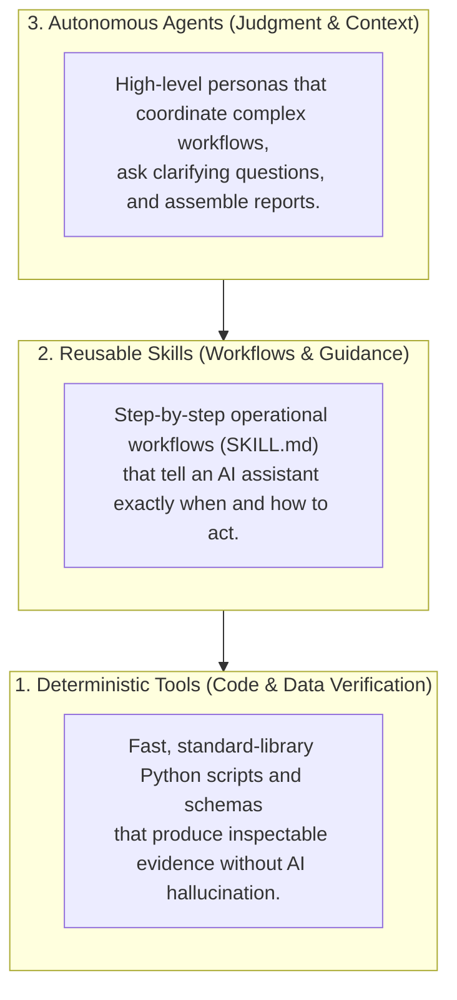

# Cybersecurity Capabilities in COPS

COPS brings together practical, defensive cybersecurity tools and AI workflows into a single unified catalog. Instead of jumping between different plugin formats or vendor platforms, security engineers can discover, test, and run capabilities locally before deciding how to deploy them.

---

## Available Security Packages

COPS currently packages five specialized security plugins across defensive domains:

| Package | Category | Maturity | What it solves | Practical boundaries |
| :--- | :--- | :---: | :--- | :--- |
| **[Security Logging Advisor](../plugins/logging-telemetry/security-logging-advisor/README.md)** | Logging & Telemetry | **Stable** | Audits application codebases for missing audit trails, sensitive data leaks (PII, tokens), and CVE reachability. | Inspects local code and configs; does not ingest live SIEM streams or connect to runtime clusters. |
| **[SOC Investigation Workbench](../plugins/detection-hunting/soc-investigation-workbench/README.md)** | Detection & Hunting | **Beta** | Guides analysts through complex alert triage using competing hypotheses, question ranking, and evidence graphs. | Decision-support and reasoning framework; does not execute automated SOAR containment actions directly. |
| **[Sentinel Hunt Workbench](../plugins/detection-hunting/sentinel-hunt-workbench/README.md)** | Detection & Hunting | **Beta** | Authors, adapts, and stress-tests 12 defensive threat hunts across Microsoft Sentinel, Defender XDR, and Data Lake. | Evaluates query logic against synthetic event streams; does not connect to live customer tenants. |
| **[Attack Path Workbench](../plugins/detection-hunting/attack-path-workbench/README.md)** | Detection & Hunting | **Experimental** | Traces multi-hop identity and lateral movement paths from cloud exports to high-value crown jewels. | Operates on offline export manifests; does not perform active network scanning or live exploitation. |
| **[Attack Surface Planner](../plugins/offensive-security/attack-surface-planner/README.md)** | Offensive Security | **Experimental** | Reconciles authorized rules-of-engagement scopes with local exports to create passive, bounded review plans. | Planning only; makes zero network calls, runs zero exploits, and requires human-signed authorization. |

To inspect the real-time status of your local catalog from your terminal, run:

```bash
python3 -m cops list
```

---

## The Three Capability Layers

Every security package in COPS is built from three complementary layers:



1. **Deterministic Tools**: Python scripts and strict JSON schemas that validate evidence, compute hashes, parse graphs, and check syntax deterministically. These do the heavy mathematical and data validation work without relying on LLM guesswork.
2. **Reusable Skills**: Structured operational recipes (defined in `SKILL.md` files conforming to the `agentskills.io` standard). These teach AI assistants *when* to trigger specific actions and *how* to guide analysts through complex workflows.
3. **Autonomous Specialist Agents**: 18 callable specialist profiles housed in [`agents/`](../agents/README.md) across offensive, defensive, forensics, identity, and governance domains, orchestrated dynamically via `python3 -m cops route`:
   - **Offensive Security**: Penetration testing (`cops-pentest-specialist`), red team emulation (`cops-redteam-operator`), attack surface planning (`cops-attack-surface-planner`), AI red teaming (`cops-ai-adversary-specialist`).
   - **Defensive & Detection**: Microsoft Sentinel KQL engineering (`cops-sentinel-kql-engineer`), threat hunting (`cops-threat-hunter`), SOC alert triage (`cops-soc-analyst`), detection-as-code (`cops-detection-engineer`).
   - **Incident Response & Forensics**: Blast radius and containment rehearsal (`cops-incident-responder`), tamper-evident evidence capture (`cops-forensic-collector`), static malware triage (`cops-malware-analyst`).
   - **Identity & Exposure**: Entra ID and cloud IAM governance (`cops-identity-specialist`), SBOM CVE reachability (`cops-exposure-analyst`), secure code review (`cops-appsec-engineer`), cyber threat intelligence (`cops-threat-intel-analyst`).
   - **Governance & Efficacy**: Purple team coordination (`cops-purple-team-coordinator`), audit telemetry architecture (`cops-logging-architect`), GRC compliance control auditing (`cops-compliance-auditor`).
   - **Triad Orchestration**: Critical tasks automatically assemble a 3-agent team (Primary Specialist + Domain Skeptic + Evidence Auditor) with mandatory interactive operator authorization.

---

## MITRE ATT&CK & Attack Flow Coverage

COPS capability logic, queries, and investigation workflows are formally mapped to the MITRE ATT&CK Enterprise Matrix (pinned v18.0) and MITRE Attack Flow:

- **[MITRE ATT&CK Coverage Matrix](COVERAGE_MATRIX.md)**: Explore normalized technique mappings, coverage roles (detection, investigation, prevention, response), validation states, and known bypass confounders.
- **[Coverage & Attack Flow Guide](ATTACK_COVERAGE.md)**: Learn how to perform gap analysis separating missing telemetry from missing analytics, export STIX 2.1 Attack Flow bundles, and add new mappings.

---

## Expanding the Catalog

As COPS evolves, additional defensive domains are planned, including:
- **Secure Code Review**: Detecting vulnerabilities before code merges.
- **Threat Modeling**: Automated stride/dread analysis from architectural diagrams and specifications.
- **Cloud Infrastructure Hardening**: Verifying Terraform and Bicep policies against CIS benchmarks.

If you would like to author a new capability, check out our **[Adding a Plugin Guide](ADDING_A_PLUGIN.md)** to learn about the manifest requirements, test conventions, and validation gates.
