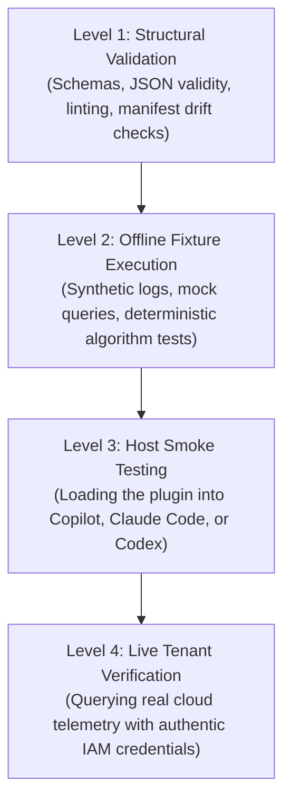

# Compatibility & Evidence Boundaries

In defensive security, knowing the difference between what has been **verifiably tested** and what has merely been **assumed** is critical. A tool that produces a plausible report against mock test data might behave very differently when querying a live enterprise tenant with millions of events.

COPS is built around **honest evidence boundaries**. We clearly distinguish between what we prove in our automated local test suites and what requires human review, host installation, or live cloud credentials.

---

## 1. The Verification Matrix

Here is how each surface is tested in COPS, what our local tests prove, and what remains to be verified in your own environment:

| Surface | Repository Artifacts | What We Prove Locally | What You Verify in the Real World |
| :--- | :--- | :--- | :--- |
| **Host-Neutral CLI** | `python3 -m cops`, `package.json` | Catalog discovery, offline demos, parameter validation, and deterministic standard-library checks. | Command line ergonomics, shell aliases, and local terminal workflow integration. |
| **GitHub Copilot** | `plugin.json`, `.github/plugin/marketplace.json` | Manifest schema validity, tool declarations, package paths, and zero manifest drift against the master catalog. | Plugin installation in VS Code or Copilot CLI, GitHub authentication, and chat model activation. |
| **Claude Code** | `.claude-plugin/marketplace.json`, `.claude-plugin/plugin.json` | Manifest agreement with catalog, tool registration, agent definitions, and syntax checks. | Loading via `claude-code`, permission prompts, terminal streaming, and live hook execution. |
| **OpenAI Codex / ChatGPT** | `.agents/plugins/marketplace.json`, `.codex-plugin/plugin.json` | Manifest interface conformity, identity/version synchronization, and directory layout checks. | Runtime behavior in OpenAI workspace, prompt formatting, and context window limits. |
| **Universal Agent Plugins v1.0.0** | `dist/agent-plugins/`, `scripts/agent/export_portable.py` | Compliance with open Agent Plugins standard, path safety, clean exports without host-specific files. | Client-specific plugin loading, runtime sandboxing, and execution environments. |
| **Contributor Workflows** | `AGENTS.md`, `.agents/skills/`, `Makefile` | Repository rules, branch hygiene checks, automated adapter generation, and code quality linters. | AI assistant model nuances, agent reasoning depth, and task orchestration strategies. |
| **Live Cloud Services** (Sentinel, Azure, Wiz) | Connector scripts, hunting profiles, query templates | Query syntax correctness, parameter typing, synthetic fixture analysis, and offline graph modeling. | **Live cloud results**: Tenant IAM permissions, query execution latency, SIEM billing impact, real false-positive rates, and live data availability. |

---

## 2. Understanding Our Support States

When reviewing COPS packages, documentation, and releases, you will encounter three explicit status labels:

- **`validated`**: The functionality has automated, executable evidence that passed directly in this repository (e.g., standard-library tests, schema validators, synthetic log parsers).
- **`unverified`**: The code, query templates, or manifests exist and are syntactically sound, but have not yet been executed against a live production tenant.
- **`not_applicable`**: The package intentionally does not support or require this integration (e.g., an offline planner designed specifically never to make network calls).

> [!NOTE]
> **Proof over Promises**:
> - Structural validation is not host execution.
> - Offline fixture testing is not live tenant verification.
> - Being listed in a marketplace index is not a guarantee of third-party store approval.

---

## 3. Four Distinct Levels of Assurance

To avoid any ambiguity when talking with auditors, security leads, or teammates, we separate assurance into four distinct levels:

1. **Level 1 (Structural)**: Ensures files are syntactically correct and comply with JSON schemas. Checked automatically with `python3 -m cops validate`.
2. **Level 2 (Offline Execution)**: Runs the security algorithms against synthetic, pre-canned data fixtures. Checked with `python3 -m cops check <plugin-id>` and `python3 -m cops demo <plugin-id>`.
3. **Level 3 (Host Installation)**: Manually loading the package into an AI assistant host to ensure it discovers the skills and responds to user prompts.
4. **Level 4 (Live Tenant Integration)**: Running queries against a real Microsoft Sentinel, AWS CloudTrail, or Entra ID environment. Requires explicit organization authorization, real credentials, and human oversight.

---

## 4. Host Smoke-Testing Checklist

Before certifying that a COPS plugin runs smoothly in your organization's specific AI assistant setup, follow this quick 5-step smoke test:

1. **Identify Host & Version**: Record the exact assistant name and release version (e.g., `Claude Code v1.0.12` or `GitHub Copilot CLI v0.2.1`).
2. **Clean Installation**: Install or register the plugin using documented discovery paths (e.g., pointing the assistant to the package directory).
3. **Verify Discovery**: Ask the assistant to list its available skills or tools. Confirm that the plugin's skills appear in the list.
4. **Execute Safe Offline Demo**: Prompt the assistant to run the plugin's safe offline demo or explain a packaged hunt. Ensure it requests only documented, expected permissions.
5. **Document the Evidence**: Record the date, assistant version, reviewer name, and observed output. Keep live-service claims separate unless real cloud telemetry was queried.

---

## 5. Authenticated Execution Compatibility and Migration

Authenticated execution adds an explicit compatibility check between the approved Action Plan and the selected worker. Operators provide the active Engagement, authorization trust store, and an independently provisioned, owner-only `cops.worker-capability-inventory/v1` artifact. That artifact identifies the worker and records exact tool versions, platform capabilities, measurement time, and measurement source. COPS does not discover installed executables at runtime; the worker owner is responsible for generating the measurement through a trusted host-baseline or deployment process and refreshing it when the host changes.

The loader requires the inventory to be a non-symlink regular file owned by the current user with no group or other permission bits. Before dispatch, the worker compares the signed snapshot with that inventory and rejects a tool-version or platform-capability mismatch, non-sequential batch semantics, an operation count above the signed maximum, or an optional expected-worker assertion that does not match the inventory.

Opening an older SQLite approval store preserves existing records but marks unsigned and digest-only approvals `legacy-untrusted`. The store exposes these through a separate read-only audit representation and retains their prior status as `historical_status`; they cannot authorize a new execution. Revalidate the current Engagement and plan, then issue a new authorization through an active trusted key; there is no automatic conversion or in-place trust upgrade.

Repository tests can prove deterministic contract validation, full-snapshot and worker binding, key/engagement window checks, compatibility rejection, atomic one-time consumption, and legacy migration against local fixtures. Each deployment must still verify secret injection, file and database permissions, the provenance and accuracy of the owner-provisioned capability measurement, operating-system process isolation, and live network controls on the actual worker host. See [Authenticated Execution](AUTHENTICATED_EXECUTION.md) for the operating procedure.
