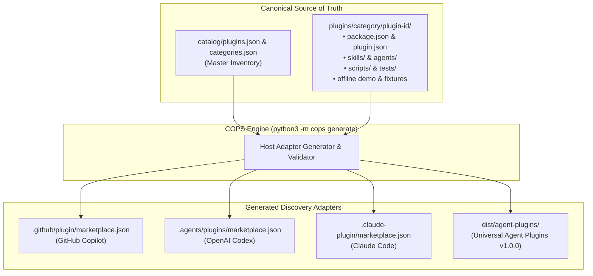

# Universal Portability Architecture

Security teams don't work in a single tool. In any modern organization, security engineers and analysts use a mix of AI assistants: GitHub Copilot in the IDE or terminal, Claude Code for autonomous command-line workflows, OpenAI Codex or ChatGPT for research, and custom agent runtimes for orchestration.

Writing separate security playbooks, skills, and configuration files for each assistant is frustrating, tedious, and invites configuration drift. COPS solves this with a **"Define Once, Adapt Everywhere"** architecture.

---

## The Core Concept

Every security tool in COPS is authored as a **host-neutral, self-contained package**. You write the core logic, defensive skills, schemas, and offline fixtures once in standard Python. COPS then automatically generates the thin compatibility adapters each AI assistant needs to discover and run those tools.



---

## Two Parallel Spines

To keep the repository clean and avoid mixing developer tools with security runtime tools, COPS maintains two distinct spines:

1. **The Product Package Spine (`plugins/`)**:
   - Contains defensive security packages (e.g., `security-logging-advisor`, `sentinel-hunt-workbench`).
   - Each package is completely self-contained. It holds its own code, tests, documentation, and agent skills.
   - Designed to run offline without external dependencies or cloud credentials.

2. **The Repository Contributor Spine (`.agents/`, `scripts/agent/`, `Makefile`)**:
   - Contains contributor-facing skills and automated maintenance workflows.
   - Coordinates repository health checks, contract validation, branch management, and automated adapter synchronization.
   - Synchronized across agent environments via `make sync-agent-adapters`.

---

## The Golden Rules of Portability

To guarantee that any tool added to COPS works reliably across assistants without surprises, every package follows five portability rules:

### 1. Single Source of Truth
Every package is registered once in `catalog/plugins.json` and assigned to exactly one primary category in `catalog/categories.json`. All host-specific marketplace manifests are derived from this catalog; we never edit host manifests by hand.

### 2. Strict Package Self-Containment
All code, test fixtures, documentation, and skill definitions live inside `plugins/<category>/<plugin-id>`. A package never reaches into a sibling plugin's private directories or relies on undeclared global variables.

### 3. Safe, Offline-First Execution
Every package provides a safe offline demonstration runnable with pure Python standard library:
```bash
python3 -m cops demo <plugin-id>
```
You don't need cloud credentials, API tokens, or an active AI assistant connection to verify that a tool works.

### 4. Process Safety: Argument Arrays, Never Shell Strings
Commands declared in manifests are always executed as explicit argument arrays (`["python3", "scripts/tool.py", "arg"]`), never passed to an arbitrary shell (`sh -c "..."`). This eliminates shell injection vulnerabilities and quoting bugs across different operating systems.

### 5. Automated Drift Prevention
Whenever a package is modified, running `python3 -m cops generate` rebuilds the marketplace indexes. Running `python3 -m cops generate --check` verifies that no files are out of sync.

---

## Universal Agent Plugins v1.0.0 Export

For environments running the open **Agent Plugins v1.0.0** specification, COPS can bundle clean, host-agnostic distribution archives:

```bash
# Verify that all packages meet the portable export specification
python3 scripts/agent/export_portable.py --check

# Export clean packages to a distribution folder
python3 scripts/agent/export_portable.py --output dist/agent-plugins
```

The exported packages strip away internal host-specific directories (such as `.claude-plugin/` and `.codex-plugin/`), leaving a lean, standards-compliant plugin containing:
- `plugin.json`: The standard root manifest.
- `skills/`: Markdown-documented capabilities conforming to the Agent Skills standard.
- `com.sodejm.copse/prerequisites.json`: Declarative system dependencies.

### Declarative Prerequisites (No Surprise Scripts)
Rather than executing arbitrary installation scripts during setup, COPS declares prerequisites as structured JSON metadata. You can inspect what external tools (like `git` or specific linters) a plugin requires without running untrusted code:

```bash
# Check if your system meets all prerequisite requirements
python3 scripts/agent/install_prerequisites.py --check

# Preview the exact package manager commands needed (without running them)
python3 scripts/agent/install_prerequisites.py --dry-run
```

---

## What Cannot Be Fully Standardized

While COPS standardizes package discovery, skill schemas, and CLI operations, AI assistant hosts differ in ways that cannot—and should not—be papered over:

- **Host Sandboxes & Permissions**: Claude Code, GitHub Copilot, and Codex have different permission models for filesystem access and bash execution.
- **Hook Events**: How and when an assistant triggers a tool before or after a model turn varies by host runtime.
- **Live Cloud Authentication**: Connecting to a real Microsoft Sentinel workspace, AWS environment, or GCP tenant requires organization-specific credentials, IAM roles, and network routing.

COPS explicitly documents these boundaries instead of pretending every assistant runs identically. For details on how we verify each layer, see [Compatibility and Evidence Boundaries](COMPATIBILITY.md).
