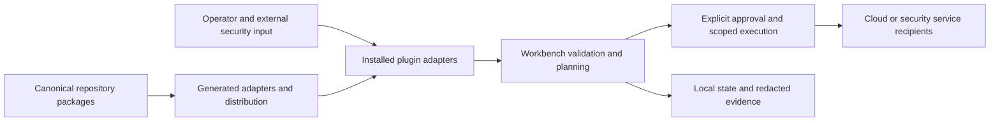

# copilot-operations-plugin-for-security detailed threat-model baseline

## Status and scope

Source baseline: `42cb017012934839702ce0b939a5cbc9193271ea`. Adoption: 2026-10-08.
Status: source-based initial model; independent human security review pending.
This model contains attack hypotheses, not validated vulnerability findings.
Existing canonical security documentation and stricter acceptance gates remain
applicable. Future changes must update this baseline rather than treating its
source revision as evidence for newer behavior.

COPS distributes security operations plugins and skills, local validation/marketplace tooling and execution/approval support. Capabilities vary by component: the Sentinel hunt workbench is offline and credential-free; other integrations can reach live APIs. No global offline or harmless-execution assumption applies.

## Assets, actors and assumptions

Assets: Plugin package and marketplace integrity; approval/checkpoint records; cloud/Sentinel credentials; tenant/resource identifiers; security telemetry and hunt results; generated report-set integrity and completion evidence; agent execution authority; CI and distribution credentials.

Actors: Authorized security operator; malicious telemetry/tool-output author; untrusted plugin contributor; compromised dependency/marketplace source; local user manipulating approval state; attacker controlling a configured API endpoint.

Assume an authorized operator, a trusted host and reviewed checkout. Treat input,
remote responses and imported content as untrusted. Repository access or a local
host administrator can bypass controls inside that same authority domain. Live
IAM, network controls, secret backend behavior and release protection require
operating evidence; they are not inferred from configuration files. Credentials,
private payloads and real identifiers must never be copied into this document.

## Components, data flows and trust boundaries

| Flow | Boundary and effective authority |
| --- | --- |
| Plugin source → validators/generator → marketplace → installed agent | Content and metadata become agent instructions and advertised capabilities. |
| Operator decision → approval store → tool execution | Approval must be bound to action, effective resource and current revision, atomically consumed. |
| Cloud integration → remote API / telemetry → agent | Credentials go only to intended recipients; telemetry remains untrusted even from authenticated services. |
| Canonical hunt skills → generated host adapters | Hashes and deterministic generation establish consistency, not trust in malicious canonical content. |
| Attack Path input → descriptor-anchored report writer → operator-selected output directory | Output paths and concurrent filesystem names remain untrusted; a report set is complete only when the completion marker and recorded hashes validate. |

The flow table defines the project-specific boundaries behind this overview.
Authentication of an upstream service does not make its content trusted. Review
the effective filesystem path, subprocess arguments, network recipient, cloud
account and credential recipient rather than only their user-supplied labels.

## Implementation evidence inventory

- `cops/execution/store.py`: inspect at the baseline revision; evidence scope is limited to this component.
- `plugins/AGENTS.md`: inspect at the baseline revision; evidence scope is limited to this component.
- `plugins/detection-hunting/sentinel-hunt-workbench/huntwb/adapters.py`: inspect at the baseline revision; evidence scope is limited to this component.
- `plugins/detection-hunting/attack-path-workbench/attackpath/azure/report.py`: descriptor-anchored report-set writes and completion-marker publication.
- `plugins/detection-hunting/attack-path-workbench/tests/test_workbench.py`: negative tests for output-path replacement, publication races, durability failures and cleanup behavior.
- `docs/SECURITY_MODEL.md`: inspect at the baseline revision; evidence scope is limited to this component.
- `scripts/agent/check.py`: inspect at the baseline revision; evidence scope is limited to this component.

## Threat register and prioritization

Impact High means private-data/credential exposure, authority escalation, material
integrity loss or substantial operational harm. Medium means bounded disclosure,
misleading results or recoverable disruption. Likelihood Medium means an exposed
or routinely supplied input could reach the boundary; Low needs stronger local
access or multiple prerequisites. P1 requires review/remediation or explicit human
risk acceptance before the affected capability is released; P2 requires scheduled
hardening and validation before expanding exposure. These are qualitative planning
priorities, not CVSS scores or proof of exploitability.

For every entry below, the human accountable owner is **maintainer/security
reviewer, assignment pending**. Triage within 30 days of adoption; complete P1
validation before the affected release/capability expansion and schedule P2 within
90 days. Existing controls do not close the hypothesis without validation.

### T01: Approval replay/race

- Attack path / prerequisite: Concurrent workers or stale configuration reuse an approval for a different action/resource.
- Inherent impact: High; likelihood: Medium; priority: P1.
- Existing evidence / limitation: store.py implements SQLite-backed approval state with transactional operations and bounded busy timeout.
- Proposed mitigation and validation: Review compare-and-transition semantics; test replay, competing consumers, changed action/recipient and expired approval.
- Residual risk / status: unverified; human review and evidence pending. Retain
  this entry until a reviewer records outcome, exact revision and remaining risk.

### T02: Approval-store tampering

- Attack path / prerequisite: Another local principal edits or replaces stored authorization evidence.
- Inherent impact: High; likelihood: Low; priority: P2.
- Existing evidence / limitation: store.py restricts directory and database modes and rejects insecure existing state.
- Proposed mitigation and validation: Test symlink/path replacement, insecure permissions and crash recovery; distinguish file integrity from hostile-host resistance.
- Residual risk / status: unverified; human review and evidence pending. Retain
  this entry until a reviewer records outcome, exact revision and remaining risk.

### T03: Telemetry prompt injection

- Attack path / prerequisite: Retrieved logs or plugin output instruct an agent to broaden scope or leak credentials.
- Inherent impact: High; likelihood: Medium; priority: P1.
- Existing evidence / limitation: Hunt router explicitly treats telemetry as untrusted and requires authorized defensive purpose.
- Proposed mitigation and validation: Review each live integration capability; test malicious telemetry against scope and credential boundaries with synthetic evidence.
- Residual risk / status: unverified; human review and evidence pending. Retain
  this entry until a reviewer records outcome, exact revision and remaining risk.

### T04: Credential/tenant confusion

- Attack path / prerequisite: Integration executes against wrong tenant or sends credentials to attacker-chosen endpoint.
- Inherent impact: High; likelihood: Medium; priority: P1.
- Existing evidence / limitation: Components have different capability contracts; offline workbench must receive no credentials.
- Proposed mitigation and validation: Inventory live endpoints and effective tenant IDs per plugin; prove recipient binding, least privilege and scoped approval.
- Residual risk / status: unverified; human review and evidence pending. Retain
  this entry until a reviewer records outcome, exact revision and remaining risk.

### T05: Adapter instruction drift

- Attack path / prerequisite: Generated host instructions diverge from canonical content or silently broaden permissions.
- Inherent impact: High; likelihood: Medium; priority: P1.
- Existing evidence / limitation: adapters.py deterministically builds host adapters and bundle hash manifest.
- Proposed mitigation and validation: Run byte-for-byte drift checks; human review canonical and generated changes, including contribution-only policy boundaries.
- Residual risk / status: unverified; human review and evidence pending. Retain
  this entry until a reviewer records outcome, exact revision and remaining risk.

### T06: Distribution compromise

- Attack path / prerequisite: Malicious package metadata or CI changes ship executable instructions without appropriate review.
- Inherent impact: High; likelihood: Medium; priority: P1.
- Existing evidence / limitation: Repository has package/marketplace validators and CI checks.
- Proposed mitigation and validation: Protect release authority and pin/review dependencies; inspect provenance at exact release head, not just validator pass.
- Residual risk / status: unverified; human review and evidence pending. Retain
  this entry until a reviewer records outcome, exact revision and remaining risk.

### T07: Operational evidence overclaim

- Attack path / prerequisite: Offline validation is reported as tenant validation or successful live remediation.
- Inherent impact: High; likelihood: Medium; priority: P1.
- Existing evidence / limitation: Hunt router expressly disallows production-readiness and detection-effectiveness claims.
- Proposed mitigation and validation: Separate offline, hosted, deployed and live evidence in PRs and release records; require authorized real-target verification.
- Residual risk / status: unverified; human review and evidence pending. Retain
  this entry until a reviewer records outcome, exact revision and remaining risk.

### T08: Build or dependency compromise

- Attack path / prerequisite: A compromised dependency, image or workflow obtains developer or release authority.
- Inherent impact: High; likelihood: Medium; priority: P1.
- Existing evidence / limitation: Repository validation is evidence of local checks, not proof of dependency provenance or hosted policy.
- Proposed mitigation and validation: Inventory and pin applicable dependencies/actions/images; review changes, scan known issues and verify exact release artifact provenance.
- Residual risk / status: unverified; human review and evidence pending. Retain
  this entry until a reviewer records outcome, exact revision and remaining risk.

### T09: Incident recovery failure

- Attack path / prerequisite: Credentials, data or service availability cannot be recovered after compromise or accidental change.
- Inherent impact: High; likelihood: Low; priority: P2.
- Existing evidence / limitation: Operational checkpoints preserve code history; data and credential recovery require separate procedures.
- Proposed mitigation and validation: Human owner must document detection signals, restricted incident evidence, credential revocation, backups and a disposable restore exercise.
- Residual risk / status: unverified; human review and evidence pending. Retain
  this entry until a reviewer records outcome, exact revision and remaining risk.

### T10: Attack Path report-set race or false completion

- Attack path / prerequisite: A concurrent local process replaces an output path or staging name, or a filesystem failure interrupts publication, so incomplete output appears complete or a foreign file becomes the completion marker.
- Inherent impact: High; likelihood: Medium; priority: P1.
- Existing evidence / limitation: The writer anchors traversal to directory descriptors, synchronizes new directories and reports before publication, creates the staging marker exclusively, publishes the open staging inode without replacement and synchronizes the published marker before cleaning up the staging name. The marker binds the run ID and report hashes, but a same-authority administrator can bypass these controls and some filesystems may provide weaker durability guarantees.
- Proposed mitigation and validation: Keep negative tests for parent/output swaps, mid-walk renames, report and synchronization failures, competing marker creation, staging substitution and cleanup failure. Require consumers to validate marker schema, run ID and hashes, then record exact-revision human review and applicable filesystem evidence before release.
- Residual risk / status: automated negative tests provide local evidence only; post-write mutation, hostile same-authority principals and filesystem-specific durability remain unverified. Human review and exact-revision acceptance are pending.

### T11: Provenance decision or guidance mapping drift

- Attack path / prerequisite: A contributor or malformed generated registry assigns a licensing review to a different source or license, or maps supporting guidance or an applicability decision to an unregistered identifier.
- Inherent impact: Medium; likelihood: Medium; priority: P2.
- Existing evidence / limitation: The provenance schema requires review fields and the integrity validator rejects duplicate guidance or decision IDs, unregistered guidance or decision targets, and review records that do not match their enclosing source and license. Guidance must resolve to an exact local registry-table entry. These controls validate metadata consistency only.
- Proposed mitigation and validation: Run the registry integrity tests and `make check` after source changes; maintainers must review changed source terms and intended reuse before accepting a disposition.
- Residual risk / status: automated checks do not determine authorship, license compatibility, whether material was copied, or the sufficiency of authorization for a particular reuse. Human review remains required.

## STRIDE and privacy coverage

| Category | Review obligation |
| --- | --- |
| Spoofing | Verify user/service/endpoint identity and binding to effective resource; reject stale/replayed authorization. |
| Tampering | Protect source, state, imported records and generated artifacts; test races and malformed input. |
| Repudiation | Record bounded, redacted action and review evidence with revision and actor; protect audit access. |
| Information disclosure | Trace secrets/private data through storage, logs, exports, backups and external recipients. |
| Denial of service | Bound input size, concurrency, retries and time; test dependency failure and recovery. |
| Elevation of privilege | Inventory tool/subprocess, filesystem, cloud and release privileges; deny unauthorized capability expansion. |
| Privacy | Confirm purpose, consent, minimization, retention/deletion and provider handling before real private data use. |

These obligations apply to each flow above. A component without a given surface
must record why the control is inapplicable; absence of evidence is not a pass.

## Security operations and open questions

Before real deployment or expanded capability, assign named human owners and
confirm effective identity/IAM, endpoint and network exposure, secret storage and
rotation, private-data lifecycle, dependency provenance, release authority and
resource limits. Record deployment/version-specific evidence and unresolved gaps.
Define redacted detection signals for rejected authorization, unexpected endpoint
changes, repeated parse failures and resource exhaustion where applicable. Keep
incident evidence access restricted. Document credential revocation, containment,
recovery owner, backups and restore validation; do not execute live destructive
or paid operations without their existing authorization.

Validate threats with synthetic negative tests and bounded local fixtures first;
use authorized integration/live checks only where needed and identify their
actual operating scope. A passing static/local test does not establish hosted,
packaged, cloud or physical-device assurance. Security findings discovered during
validation need reproducible evidence and separate tracked remediation.

## Maintenance and human acceptance

Update this model alongside changes to any listed asset, flow, recipient,
permission, parser, dependency, build or deployment assumption. Review at each
release and quarterly; record next review date when a human accepts the baseline.
Use [Engineering review policy](ENGINEERING_REVIEW.md) for reference frameworks,
checkpoint commits and exact-revision approval, and
[Review coverage](security/REVIEW_COVERAGE.md) for the outstanding retroactive
inventory. Human reviewer/date/accepted revision: **pending**. No residual risk is
accepted by this initial document.
