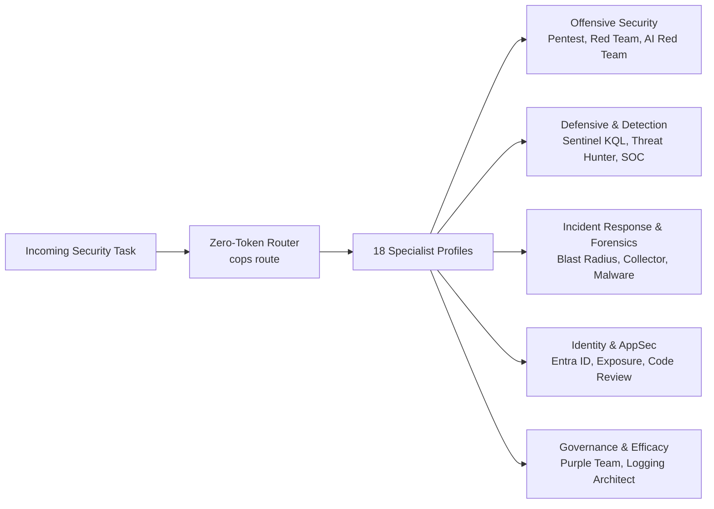

<div class="cops-hero">
  
  <h1 class="cops-hero-title">COPS</h1>
  <p class="cops-hero-tagline">
    Copilot Operations Plugins for Security: an open-source, universal catalog of defensive cybersecurity plugins, 18 specialist agent profiles, and offline verification tools for AI coding assistants.
  </p>
  <div class="cops-cta-row">
    <a href="getting-started.html" class="cops-btn cops-btn-primary">5-Minute Quickstart</a>
    <a href="plugin-guide.html" class="cops-btn cops-btn-secondary">Explore 13 Plugins</a>
    <a href="specialist-agents.html" class="cops-btn cops-btn-secondary">18 Specialist Agents</a>
    <a href="https://github.com/sodejm/copilot-operation-plugin-for-security" class="cops-btn cops-btn-secondary">GitHub Repository</a>
  </div>
</div>

## Why COPS?

Whether your engineering and security teams operate in **GitHub Copilot**, **Claude Code**, or **Codex / ChatGPT**, COPS provides production-grade cybersecurity capabilities without vendor lock-in.

- **100% Offline-First by Default**: Explore tools, run demos, and validate detection logic straight from your local terminal with standard Python. No cloud credentials, assistant installations, or live tenant connections required.
- **Deterministic Script-First Tooling**: Offloads calculations, graph traversals, and schema validations to standard-library Python scripts. Fast, deterministic, and preserves model tokens.
- **Universal Multi-Assistant Portability**: A single catalog in `catalog/plugins.json` powers GitHub Copilot, Claude Code, and Codex with zero configuration drift.
- **18 Specialist Agent Profiles**: Pre-tuned security personas spanning detection engineering, threat hunting, DFIR, cloud IAM, and AppSec, with dynamic zero-token routing and Triad orchestration.
- **Truth-in-Advertising & Evidence Standard**: Every capability is categorized into four explicit operational readiness modes (`planned`, `import`, `laboratory`, `live-validated`), preventing over-claiming.
- **MITRE ATT&CK & Attack Flow Coverage**: Formally mapped against the pinned ATT&CK Enterprise Matrix (v18.0) and MITRE Attack Flow standards.

---

## 5-Minute Quickstart

Run these standard Python commands in your terminal to explore the catalog:

```bash
# 1. Clone the repository
git clone https://github.com/sodejm/copilot-operation-plugin-for-security.git
cd copilot-operation-plugin-for-security

# 2. Check local environment health and catalog synchronization
python3 -m cops doctor

# 3. List all 13 plugins and their validation status
python3 -m cops list

# 4. Route a natural language security task to the optimal specialist
python3 -m cops route "Optimize Sentinel KQL query for high-volume sign-in events"

# 5. Run a safe, offline demonstration with synthetic data
python3 -m cops demo sentinel-hunt-workbench

# 6. Run the plugin's deterministic verification suite
python3 -m cops check sentinel-hunt-workbench
```

Read the full [Getting Started Guide](getting-started.md) for detailed step-by-step instructions.

---

## Cybersecurity Capability Domains

COPS organizes 13 dedicated security plugins across six cybersecurity disciplines:

<div class="cops-grid">
  <div class="cops-card">
    <h3>📡 Logging &amp; Telemetry</h3>
    <p>Audit codebases for security logging gaps, flag sensitive data leaks, and verify end-to-end pipeline routes from Cribl to Splunk and Sentinel.</p>
    <p><strong>Plugins:</strong> <a href="plugin-guide.html#security-logging-advisor">Security Logging Advisor</a> <span class="badge badge-stable">Stable</span>, <a href="plugin-guide.html#telemetry-proof-pack">Telemetry Proof Pack</a> <span class="badge badge-beta">Beta</span></p>
  </div>
  <div class="cops-card">
    <h3>🔍 Detection &amp; Hunting</h3>
    <p>Guide SOC alert triage with rival hypotheses, stress-test 12 Microsoft Sentinel KQL hunts, trace cloud lateral movement paths, and enrich indicators.</p>
    <p><strong>Plugins:</strong> <a href="plugin-guide.html#soc-investigation-workbench">SOC Investigation</a>, <a href="plugin-guide.html#sentinel-hunt-workbench">Sentinel Hunt</a>, <a href="plugin-guide.html#attack-path-workbench">Attack Path</a>, <a href="plugin-guide.html#detection-quality-workbench">Detection Quality</a>, <a href="plugin-guide.html#threat-intelligence-enrichment">Threat Intel</a></p>
  </div>
  <div class="cops-card">
    <h3>🔑 Identity &amp; Access</h3>
    <p>Audit Microsoft Entra ID role assignments, app registrations, service principal credentials, and consent grants from offline JSON exports.</p>
    <p><strong>Plugins:</strong> <a href="plugin-guide.html#entra-identity-workbench">Entra Identity Workbench</a> <span class="badge badge-beta">Beta</span></p>
  </div>
  <div class="cops-card">
    <h3>🛡️ Vulnerability Management</h3>
    <p>Correlate advisory CVEs with software bills of materials (SBOM) and call graph reachability, and inspect pull request diffs for dangerous patterns.</p>
    <p><strong>Plugins:</strong> <a href="plugin-guide.html#exposure-triage-workbench">Exposure Triage</a> <span class="badge badge-beta">Beta</span>, <a href="plugin-guide.html#patch-security-review">Patch Security Review</a> <span class="badge badge-beta">Beta</span></p>
  </div>
  <div class="cops-card">
    <h3>⚔️ Offensive Security</h3>
    <p>Translate authorized rules of engagement into bounded, passive review plans and evaluate AI agent prompt injection resistance in a sandbox.</p>
    <p><strong>Plugins:</strong> <a href="plugin-guide.html#attack-surface-planner">Attack Surface Planner</a> <span class="badge badge-experimental">Experimental</span>, <a href="plugin-guide.html#foundry-agent-harness">Foundry Agent Harness</a> <span class="badge badge-beta">Beta</span></p>
  </div>
  <div class="cops-card">
    <h3>🚨 Incident Response</h3>
    <p>Rehearse containment playbooks, calculate cloud resource blast radius, and generate cryptographic execution receipts under interactive operator approval.</p>
    <p><strong>Plugins:</strong> <a href="plugin-guide.html#incident-response-sandbox">Incident Response Sandbox</a> <span class="badge badge-beta">Beta</span></p>
  </div>
</div>

For a side-by-side comparison of problem statements and operational playbooks, see [When to Use Each Plugin](plugin-guide.md).

---

## 18 Specialist Agent Profiles & Dynamic Routing

COPS centralizes 18 callable specialist profiles housed in [`agents/`](specialist-agents.md) across offensive, defensive, forensics, identity, and governance domains:



When high-risk operations are requested (e.g. penetration testing, red team emulation, active containment rehearsal), COPS dynamically activates **Triad Orchestration** (Primary Specialist + Domain Skeptic + Evidence Auditor) requiring interactive human operator confirmation.

Learn more in the [Specialist Agents Guide](specialist-agents.md).

---

## Documentation Quick Links

- [5-Minute Quickstart Guide](getting-started.md): Installation, diagnostics, and running your first demo.
- [Plugin Selection Guide](plugin-guide.md): Clear criteria on when to reach for each plugin.
- [18 Specialist Agents](specialist-agents.md): Agent catalog, zero-token routing, and Triad safety.
- [ATT&CK Matrix (v18.0)](COVERAGE_MATRIX.md): Mappings and validation state across all capabilities.
- [Universal Portability](PORTABILITY.md): Multi-assistant sync architecture.
- [Contributor Guide](contributing.md): Development environment setup, adding plugins, and test gates.
- [Troubleshooting](troubleshooting.md): Step-by-step solutions for common setup issues.
- [Security Model](SECURITY_MODEL.md): Threat modeling, prompt injection resistance, and readiness modes.
- [Engagement Contracts Specification](../specs/engagement-contracts.spec.md): Schema contracts for engagements, scenarios, action plans, and findings.
- [Execution Authorization Specification](../specs/execution-authorization.spec.md): Cryptographically bound approval envelopes and legacy receipt rejection.
- [Isolated Worker and Approval Store Specification](../specs/isolated-worker-approval-store.spec.md): Process boundaries, SQLite approval store, and anti-replay execution.
- [Execution Scope & Egress Specification](../specs/execution-scope-enforcement.spec.md): Execution-time destination verification, cloud metadata defense, and DNS pinning.
- [Tool Adapter Registry Specification](../specs/tool-adapter-registry.spec.md): Declarative typed parameters, command assembly, and parameter injection prevention.
- [Credential and Evidence Handling Specification](../specs/credential-evidence-handling.spec.md): Real-time stream redaction, secret masking, and cryptographic run-result evidence binding.
- [Pinned Scenario Registry](../specs/pinned-scenario-registry.spec.md): Pinned research sources and canonical scenario registry.
- [Capability Reconciliation](../specs/capability-reconciliation.spec.md): Operational readiness taxonomy and truth-in-advertising invariants.
