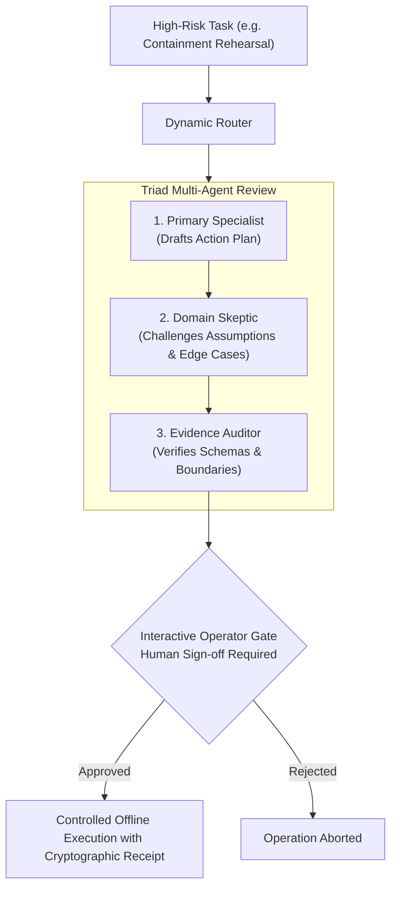

# 18 Specialist Cybersecurity Agents & Dynamic Routing

COPS centralizes **18 specialist cybersecurity agent profiles** housed in `agents/`. Each profile defines a dedicated persona, tool allowlist, domain constraints, and evaluation criteria tailored to specific security disciplines.

Rather than relying on a generic assistant prompt, COPS routes tasks to the specialist profile with the highest domain precision.

---

## Dynamic Zero-Token Routing (`cops route`)

COPS includes a deterministic router implemented in standard Python. It parses task semantics, matches keywords, and selects the ideal specialist profile **without consuming LLM tokens** or calling external APIs:

```bash
# Route any natural language task:
python3 -m cops route "Review this Microsoft Sentinel KQL query for high ingestion cost"

# Route an incident containment task:
python3 -m cops route "Rehearse containment of a compromised service principal with blast radius proof"

# Route an application security review:
python3 -m cops route "Audit this Python codebase for missing audit logs and credential leaks"
```

To list all 18 specialist profiles from your terminal:

```bash
python3 -m cops specialists
```

---

## Specialist Catalog by Discipline

### 1. Offensive Security

| Agent Profile ID | Role | Key Capabilities |
| :--- | :--- | :--- |
| `cops-pentest-specialist` | Penetration Testing Specialist | Scoping validation, non-destructive methodology planning, vulnerability assessment. |
| `cops-redteam-operator` | Red Team Operations Specialist | Threat actor emulation planning, ATT&CK TTP mapping, defensive evasion analysis. |
| `cops-attack-surface-planner` | Attack Surface Planner | Passive reconnaissance planning, domain mapping, in-scope vs. out-of-scope enforcement. |
| `cops-ai-adversary-specialist` | AI Adversary & Red Teamer | Prompt injection resistance testing, jailbreak evaluation, model safety boundaries. |

---

### 2. Defensive & Detection Engineering

| Agent Profile ID | Role | Key Capabilities |
| :--- | :--- | :--- |
| `cops-sentinel-kql-engineer` | Microsoft Sentinel KQL Engineer | High-performance KQL authoring, multi-table joins, ingestion cost optimization, Defender XDR adaptation. |
| `cops-threat-hunter` | Threat Hunter | Hypothesis generation, baseline anomaly detection, living-off-the-land (LotL) hunting. |
| `cops-soc-analyst` | SOC Alert Analyst | Tier 1-3 alert triage, Analysis of Competing Hypotheses (ACH), inquiry question ranking. |
| `cops-detection-engineer` | Detection Engineer | Detection-as-code, SPL and KQL syntax validation, regression testing against synthetic events. |

---

### 3. Incident Response & Forensics

| Agent Profile ID | Role | Key Capabilities |
| :--- | :--- | :--- |
| `cops-incident-responder` | Incident Responder | Containment playbooks, blast radius calculation, cryptographic execution receipts. |
| `cops-forensic-collector` | Forensic Evidence Collector | Tamper-evident evidence capture, hash generation, chain-of-custody verification. |
| `cops-malware-analyst` | Static Malware Analyst | Static binary triage, string extraction, PE header analysis, capability identification. |

---

### 4. Identity & Application Security

| Agent Profile ID | Role | Key Capabilities |
| :--- | :--- | :--- |
| `cops-identity-specialist` | Cloud Identity & Access Specialist | Microsoft Entra ID role analysis, service principal credential hygiene, OAuth consent audits. |
| `cops-exposure-analyst` | Vulnerability Exposure Analyst | SBOM correlation (CycloneDX/SPDX), CVE reachability analysis, exploit exposure scoring. |
| `cops-appsec-engineer` | Application Security Engineer | Static code review, logging gap analysis, patch security review, CWE pattern detection. |
| `cops-threat-intel-analyst` | Threat Intelligence Analyst | IOC enrichment, MITRE ATT&CK actor attribution, offline feed correlation. |

---

### 5. Governance, Efficacy & Architecture

| Agent Profile ID | Role | Key Capabilities |
| :--- | :--- | :--- |
| `cops-purple-team-coordinator` | Purple Team Coordinator | Joint offensive-defensive exercise design, detection gap analysis, remediation tracking. |
| `cops-logging-architect` | Enterprise Logging Architect | Telemetry pipeline design (Cribl Stream, Splunk, Sentinel), ingestion volume management. |
| `cops-compliance-auditor` | Security & Compliance Auditor | Regulatory control mapping (SOC 2, ISO 27001, NIST CSF), evidence verification. |

---

## Triad Orchestration for High-Risk Operations

For sensitive or destructive operational domains (penetration testing, active containment rehearsal, red teaming, cloud IAM modifications), single-agent execution introduces unverified risk.

COPS dynamically activates **Triad Orchestration** whenever high-risk tasks are detected:



1. **Primary Specialist**: Drafts the proposed plan and technical parameters.
2. **Domain Skeptic**: Actively challenges the plan, seeking false positives, unintended consequences, and unverified assumptions.
3. **Evidence Auditor**: Validates contract schemas, bounding limits, and input integrity.
4. **Mandatory Operator Authorization**: The orchestrated plan cannot execute until a human operator explicitly approves the action.

---

## Using Specialist Profiles in AI Assistants

Each specialist profile is packaged for immediate use across:
- **GitHub Copilot**: Configured in `.github/copilot-instructions.md` and repository skills.
- **Claude Code**: Packaged under `.claude/` and callable via subagents.
- **Codex / ChatGPT**: Packaged under `.agents/` and registered with the Agent Skills specification.
