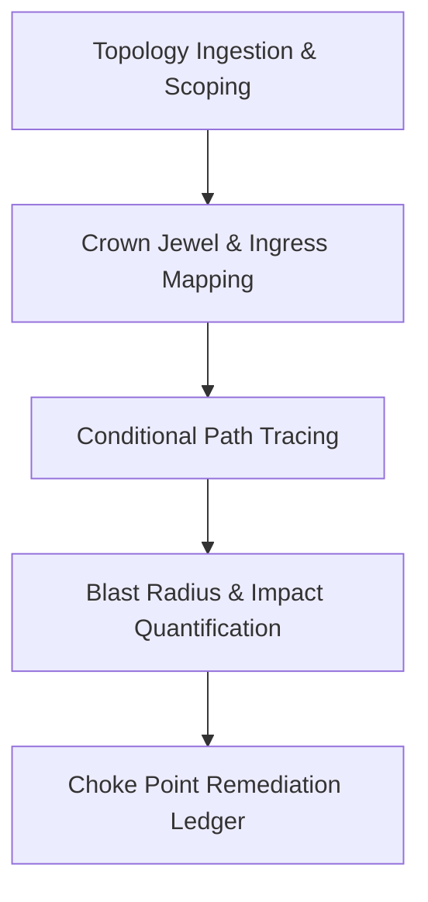

# Attack Path Workbench Analyst & Engineer Playbook

## 1. Overview & Intended Personas

The **COPS Attack Path Workbench** provides deterministic, offline-capable analysis of complex cloud identity, access, and infrastructure topologies to trace conditional attack paths and identify optimal remediation choke points.

- **Primary Personas**:
  - **Cloud Security Engineers & Architects**: Analyzing IAM role graphs, service principal permissions, and network topologies (e.g., Azure RBAC, AWS IAM, or Wiz exports).
  - **Red / Blue Team Analysts**: Tracing how an initial access finding (vulnerable host, exposed service) can pivot laterally to compromise high-value assets.
  - **Security Operations & Remediation Leads**: Prioritizing fixes by eliminating attack path "choke points" instead of chasing thousands of isolated alerts.



---

## 2. When to Use This Plugin

Invoke this plugin under the following scenarios:

| Trigger Scenario | Operational Objective | Primary Skills Invoked |
| :--- | :--- | :--- |
| **Cloud IAM & Entitlement Reviews** | Analyze complex multi-tier permission grants and privilege escalation chains across subscriptions/tenants. | `attack-path-ingest`, `attack-path-trace` |
| **Vulnerability-to-Asset Reachability** | Determine whether an external CVE finding on a compute resource has an evidenced route to high-value data stores. | `attack-path-map`, `attack-path-trace` |
| **Choke-Point Remediation Planning** | Identify the minimal set of policy or network changes that breaks the maximum number of critical lateral paths. | `attack-path-assess`, `attack-path-report` |
| **Pre-Production Architecture Validation** | Model proposed IAM changes offline to ensure new service principals do not introduce unintended lateral attack vectors. | `attack-path-trace`, `attack-path-review` |

### Operational Boundaries & Safety Guarantees
- **Offline Analysis Only**: The workbench analyzes offline JSON export files. It **makes zero network calls** and requires no live Azure, AWS, or Wiz credentials.
- **Separation of Evidence States**:
  - *Supported Paths*: Every link is proven by local evidentiary records (active role assignment, verified network route).
  - *Candidate Paths*: Theoretical paths with explicit unverified preconditions or hypothetical relationships.
- **Business Rating Constraint**: Impact is rated `unrated` unless backed by an explicit, approved business-impact profile document.

---

## 3. Five-Phase Engineering Playbook

### Phase 1: Export Ingestion & Hash-Pinned Verification
**Skill**: [`attack-path-ingest`](../skills/attack-path-ingest/SKILL.md)

1. **Verify Export Manifest**:
   - Confirm input JSON conforms to the expected contract (e.g., illustrative fixture or normalized cloud topology schema).
   - Validate tenant boundaries and ensure scope restrictions are strictly declared.
2. **Execute Ingestion & Integrity Check**:
   - Run ingestion check via CLI:
     ```bash
     python3 plugins/detection-hunting/attack-path-workbench/scripts/attackpath.py analyze <input-export.json> --output-dir /tmp/attackpath-output
     ```
   - Verify SHA-256 hashes of input files to guarantee deterministic re-runs.

### Phase 2: Crown Jewel & Ingress Vector Mapping
**Skill**: [`attack-path-map`](../skills/attack-path-map/SKILL.md)

1. **Specify Target Crown Jewels**:
   - Define critical assets: production Key Vaults, sensitive customer databases, or domain controller roles.
2. **Specify Initial Ingress Finding**:
   - Select entry-point finding (e.g., public workload running vulnerable package, exposed bastion host).
3. **Establish Boundary Scopes**:
   - Define included subscription IDs, resource groups, and tenant IDs. Explicitly exclude out-of-scope partner tenants.

### Phase 3: Conditional Path Tracing & Hop Validation
**Skill**: [`attack-path-trace`](../skills/attack-path-trace/SKILL.md)

1. **Execute Graph Traversal**:
   - Traverse identity hops (User $\rightarrow$ Group $\rightarrow$ Role Assignment $\rightarrow$ Resource $\rightarrow$ Managed Identity).
   - Trace network access hops (Public IP $\rightarrow$ NSG Rule $\rightarrow$ VNet Peering $\rightarrow$ Private Endpoint).
2. **Differentiate Path Evidence**:
   - Validate that each hop cites active permission records. Flag any step relying on expired credentials or unverified assumptions as candidate-only.

### Phase 4: Blast Radius & Impact Quantification
**Skill**: [`attack-path-assess`](../skills/attack-path-assess/SKILL.md)

1. **Calculate Asset Exposure**:
   - Measure total downstream assets accessible if the intermediate node is compromised.
2. **Assess Potential CIA Impact**:
   - Determine potential Confidentiality (data read), Integrity (resource modification), or Availability (disruption) impacts.
3. **Document Uncertainties**:
   - If telemetry or effective permissions are partial, emit an explicit uncertainty declaration.

### Phase 5: Choke Point Remediation & Executive Reporting
**Skills**: [`attack-path-report`](../skills/attack-path-report/SKILL.md), [`attack-path-review`](../skills/attack-path-review/SKILL.md)

1. **Generate Remediation Ledger**:
   - Identify intersection nodes (choke points) across all paths reaching the crown jewel.
   - Rank recommendations: e.g., removing one excessive `Contributor` assignment eliminates 8 distinct attack paths.
2. **Export Review Artifacts**:
   - Generate `report.json`, `report.md`, `graph.json`, and `remediation-ledger.json`.
3. **Conduct Peer / Architecture Review**:
   - Review proposed remediations with cloud engineering before applying infrastructure-as-code changes.

---

## 4. Verification & Gate Checks

Verify the workbench implementation and reproduce illustrative outputs:

```bash
# Offline unit tests
python3 -m unittest discover -s plugins/detection-hunting/attack-path-workbench/tests -v

# Package validation gate
python3 plugins/detection-hunting/attack-path-workbench/scripts/validate-package.py
```
