# Architecture and analysis method

The workbench is an offline package. The CLI reads a local manifest and local export, executes deterministic stages, and writes a canonical report plus readable projections. The only runnable source adapter is an **illustrative synthetic contract**. No installed code authenticates to Wiz, renders Wiz syntax, downloads references, or invokes a specialist model.

| Component | Purpose and required inputs | Output | Failure or uncertainty behavior |
|---|---|---|---|
| Source intake | Check manifest, relative source paths, hashes, UTC export time, scope, and pinned profile. | Verified input set and declared coverage. | Integrity or unsupported profile blocks the run. Declared completeness is never treated as verified. |
| Normalizer and provenance | Convert documented synthetic rows using their source hash and JSON pointer. | Typed evidence and reconciliation counts. | Unknown and ambiguous rows enter quarantine. Duplicate IDs make **all** rows with that ID ineligible. |
| Query-intent builder | Take analyst start, target, and scope selectors. | Versioned unrendered query intent. | Wiz operation, relationship names, syntax, pagination, and authentication stay `[PENDING_WIZ_DOCS]`. |
| Graph and path engine | Join typed findings, nodes, edges, crown-jewel IDs, and declared capability rules. | Evidence-linked graph, conditional paths, and partial routes. | Invalid endpoints and types are excluded. Missing capability or hypothesized fact creates a candidate route with a named gap. |
| Impact and rank engine | Take path steps, supported prefix, supplied priority, and future approved impact criteria. | Bounded distinct asset/service counts, potential CIA, stable order. | Business rating is `unrated` without an approved rubric and service context. Unknown source coverage remains unknown. |
| MITRE adapter | Take described action plus a future pinned, local ATT&CK and Attack Flow reference bundle. | Technique mapping and flow serialization interfaces. | Emits no IDs or flow serialization until those references and behavior evidence exist. |
| Specialist review | Take a bounded path, impact, technique, action, or claim packet with evidence index. | Structured advisory opinion and alternatives. | Specialists cannot alter source facts or gate outcomes. Conflicts require human disposition; the current CLI does not run them. |
| Report and ledger | Take validated graph, paths, assessments, and proposed actions. | Canonical JSON, Markdown, graph projection, and proposed-action ledger. | Missing claim references block publication. Owner and closure evidence remain null; no action is automatically closed. |

## End-to-end flow

```mermaid
flowchart LR
  M[Local manifest and export] --> G1[G1 integrity and schema]
  G1 --> N[Normalize with source pointers]
  N --> G2[G2 provenance and counts]
  G2 --> G[Typed graph]
  G --> G3[G3 edge and path validity]
  G3 --> P[Conditional paths and gaps]
  P --> G4[G4 deduplicate and rank]
  G4 --> I[G5 bounded impact]
  I --> A[G6 pending MITRE adapter]
  A --> C[G7 cited claims]
  C --> R[G8 canonical report and ledger]
```

The starting point is a source-stated finding on an asset; the target is a user-designated asset. A finding on the crown jewel itself produces a zero-step structural path with no inferred CIA effect. An edge is traversable only when its typed endpoints and direction are valid and it declares preconditions and a postcondition. The first capability is `finding_on_asset`, representing a **conditional successful exploit premise**, not observed exploitation. A missing capability can be used to explore a candidate scenario, but that step and its successors do not contribute to evidenced blast radius or potential CIA. A sourced structural route is still a potential scenario. Neither class is a confirmed attack.

The graph stores `asset`, `identity`, `data`, and `service` nodes. The illustrative profile uses `reachable_from`, `permission_to_act`, `accesses_data`, and `service_depends_on`. A dependency is kept for context and never traversed as an attacker action. Every accepted fact carries a source pointer and file hash. One snapshot time and scope are required for joins; mixed snapshots need an approved temporal rule before they can be analyzed together. See [data contract](data-contract.md) for record shapes.

Paths are grouped by finding, target, ordered node/relation sequence, preconditions, postconditions, support state, missing capabilities, and scope. Equivalent evidence is retained on the grouped step. Supported and candidate classes are sorted separately using supplied crown-jewel priority (null last), distinct evidenced asset count, count of services with observed direct dependencies on those assets, supported-step fraction, then stable path ID. There is no exploit probability, path-length penalty, or hidden weight.

## Impact and reference boundaries

The workbench counts distinct assets on the supported path segment and distinct services with observed direct dependencies on those assets. It does not traverse longer service dependency chains, infer service disruption from dependency alone, or estimate an inventory total. Supported `read`, `modify`, and `disrupt` postconditions are labeled as **potential** confidentiality, integrity, and availability effects. They become business consequences only after the user supplies crown-jewel criticality, service dependencies, CIA objectives, and an approved rubric. The profile contract requires the specific NIST publication, any other chosen framework, organization thresholds, approval authority, and criterion citations. The supplied links do not establish such a rubric, so the current output is `unrated`.

ATT&CK mappings will require a behavior description, exact matrix and technique ID, pinned local catalog version, and cited action evidence. A CVE or asset label alone is insufficient. Attack Flow serialization will require a pinned local format contract for actions, conditions, and relations. Until then the report records `pending_reference_bundle` and an empty mapping list.

Each recommendation is linked to a path and source evidence, with a validation check, monitoring idea, and follow-up investigation. The ledger starts in `proposed` state. Closure needs a user-supplied owner and validation evidence, such as an authorized test or later observation; re-export alone does not prove remediation.

## Human review and open decisions

The five bounded specialist definitions in `agents/` state their packet input, typed output, and evaluation cases. Their opinions are advisory. An orchestrator must preserve each opinion, prompt version, packet hash, model settings, citations, alternatives, and human disposition. A gate/specialist disagreement stays visible. An unresolved material claim-auditor objection blocks publication of that claim. There is no automatic agent orchestration in this release.

Before real integration, supply: redacted Wiz exports and field/relationship documentation; exact query/API and coverage semantics; user crown jewels, service map, and business-impact criteria; locally approved ATT&CK and Attack Flow bundles; and the human authority for review and remediation closure. The current illustrative records are invented test data and establish no real exposure.
