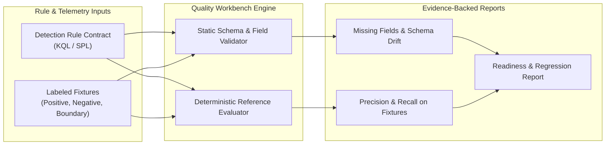

# Detection Quality & Regression Workbench

A deterministic testing and validation workbench for Microsoft Sentinel KQL and Splunk SPL detection rules.

## Why This Workbench Exists

In modern enterprise Security Operations Centers (SOCs), detection rules are the frontline defense against sophisticated attacks. However, detection engineering often suffers from critical quality challenges:

1. **Alert Fatigue and False Positives**: Rules tested only against theoretical queries frequently overwhelm analysts with thousands of false alerts when applied to live operational logs.
2. **Silent Telemetry Failures**: An upstream ingestion change (such as an agent update dropping a field like `IPAddress` or `ScriptBlockText`) causes detection rules to silently fail without throwing visible errors.
3. **Regression Blindness**: When engineers modify a query to catch a new adversary bypass, they often unintentionally break existing coverage or re-introduce noise.
4. **Lack of Test Fixtures**: Unlike traditional software engineering, detection rules are rarely accompanied by unit tests with labeled positive and negative test cases.

The **Detection Quality & Regression Workbench** (`detection-quality-workbench`) bridges this gap by bringing automated software testing standards to detection engineering:
- **Contract-First Rule Specifications**: Explicitly declare required vs. optional fields, data sources, time windows, and expected signals.
- **Labeled Telemetry Fixture Suites**: Validate rules against repeatable test cases representing verified attacks (true positives), benign baseline noise (true negatives), and boundary edge-cases (missing fields, schema drift, string collisions).
- **Deterministic Reference Evaluator**: Computes objective precision and recall baselines on labeled test cases before deployment.



## Key Capabilities

1. **Dual-Platform Support**: Supports both **Microsoft Sentinel KQL** (Log Analytics, Advanced Hunting) and **Splunk SPL** (Search Processing Language) contracts.
2. **Precision & Recall on Labeled Fixtures**:
   - **True Positives (TP)**: Target adversary techniques correctly caught.
   - **False Positives (FP)**: Benign administrative activity incorrectly flagged.
   - **True Negatives (TN)**: Expected baseline operations correctly ignored.
   - **False Negatives (FN)**: Target attacks missed by strict query conditions.
3. **Telemetry Dependency & Schema Drift Analysis**: Scans telemetry records to verify all required fields are present. Flags missing fields and schema changes before rules are pushed to production SIEMs.
4. **Automated Regression Baselines**: Enables automated test-suite runs in CI/CD pipelines to ensure rule revisions never degrade existing detection coverage.

> [!IMPORTANT]
> **Precision and recall are measured strictly on labeled test fixtures.** They provide vital regression baselines and identify filter bugs, but do not prove production scheduled alert firing rates.

## Directory Structure

```
detection-quality-workbench/
├── .claude-plugin/plugin.json             # Claude marketplace manifest
├── .codex-plugin/plugin.json              # Codex marketplace manifest
├── com.sodejm.copse/prerequisites.json     # Copilot Studio configuration
├── package.json                           # Canonical package descriptor
├── plugin.json                            # Universal plugin manifest
├── README.md                              # Primary overview and usage documentation
├── docs/
│   └── PLAYBOOK.md                        # Step-by-step detection engineer playbook
├── detectionquality/                      # Standard-library runtime engine
│   ├── __init__.py                        # Package exports
│   ├── cli.py                             # Operator CLI commands
│   ├── evaluator.py                       # Deterministic reference evaluator
│   ├── models.py                          # Typed immutable dataclasses
│   ├── reporting.py                       # Markdown and JSON report generators
│   └── static_analysis.py                 # Telemetry field and schema validator
├── rules/                                 # Standardized detection rule contracts
│   ├── RULE-KQL-ENTRA-ANOMALOUS-SIGNIN.json
│   └── RULE-SPL-DEFENDER-POWERSHELL-EXEC.json
├── fixtures/                              # Labeled positive and negative test suites
│   ├── RULE-KQL-ENTRA-ANOMALOUS-SIGNIN.json
│   └── RULE-SPL-DEFENDER-POWERSHELL-EXEC.json
├── schemas/                               # Strict JSON schemas
│   ├── fixture.schema.json
│   ├── report.schema.json
│   └── rule.schema.json
├── scripts/
│   ├── run_demo.py                        # Executable offline demo runner
│   └── validate_package.py                # Package integrity gate
├── skills/
│   └── detection-quality-review/          # Contributor and agent skill definition
│       └── SKILL.md
└── tests/
    └── test_workbench.py                  # Automated unit test suite
```

## Quick Start

### 1. Run the Demonstration

Run the automated evaluation across all bundled Sentinel KQL and Splunk SPL rules:

```bash
python3 plugins/detection-hunting/detection-quality-workbench/scripts/run_demo.py
```

### 2. Validate Rule Contracts via CLI

Verify that all rule definitions follow strict schema requirements:

```bash
python3 plugins/detection-hunting/detection-quality-workbench/detectionquality/cli.py validate \
  --rules-dir plugins/detection-hunting/detection-quality-workbench/rules
```

### 3. Evaluate a Rule Against Test Fixtures

Generate a Markdown quality and readiness report:

```bash
python3 plugins/detection-hunting/detection-quality-workbench/detectionquality/cli.py evaluate \
  --rule plugins/detection-hunting/detection-quality-workbench/rules/RULE-KQL-ENTRA-ANOMALOUS-SIGNIN.json \
  --fixtures plugins/detection-hunting/detection-quality-workbench/fixtures/RULE-KQL-ENTRA-ANOMALOUS-SIGNIN.json
```

To export structured JSON for automated CI/CD gating:

```bash
python3 plugins/detection-hunting/detection-quality-workbench/detectionquality/cli.py evaluate \
  --rule plugins/detection-hunting/detection-quality-workbench/rules/RULE-KQL-ENTRA-ANOMALOUS-SIGNIN.json \
  --fixtures plugins/detection-hunting/detection-quality-workbench/fixtures/RULE-KQL-ENTRA-ANOMALOUS-SIGNIN.json \
  --json \
  --output report.json
```

### 4. Run the Full Quality Test Suite

Run regression evaluation across all rules in one command:

```bash
python3 plugins/detection-hunting/detection-quality-workbench/detectionquality/cli.py test-suite \
  --rules-dir plugins/detection-hunting/detection-quality-workbench/rules \
  --fixtures-dir plugins/detection-hunting/detection-quality-workbench/fixtures
```

## Boundaries & Operational Integrity

- **Offline Analysis**: The workbench operates completely offline with standard-library Python. It requires no live cloud credentials or search cluster connections.
- **Reference Evaluation vs. Production Firing**: Syntactic validity and fixture matching do not guarantee that a scheduled query fired in production. Ingestion delays and query timeouts must be monitored separately.
