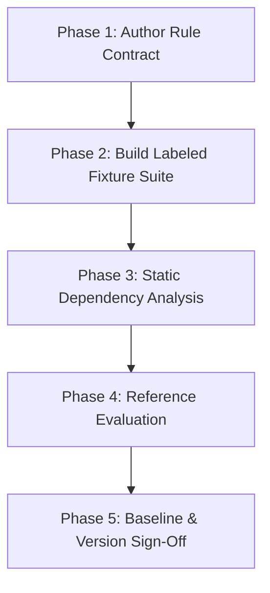

# Detection Engineer Playbook: Detection Quality & Regression Review

This playbook guides detection engineers, SIEM administrators, and threat hunters through authoring, testing, and validating detection rules using the **Detection Quality & Regression Workbench**.

---

## 1. Objectives & Overview

In high-volume enterprise environments, deploying an untested detection rule is a recipe for operational headaches. A rule that generates excessive false positives burns out SOC analysts, while a rule that depends on unindexed or missing telemetry silently misses intrusions.

The **Detection Quality & Regression Workbench** treats detection rules as version-controlled software artifacts. By combining contract specifications with labeled test fixtures, engineers can:
- Verify that queries compile and execute against realistic data.
- Catch missing fields and schema drift before they cause silent failures.
- Measure baseline precision and recall on target attacks.
- Prevent regression bugs when tuning existing rules.

---

## 2. The 5-Phase Detection Quality Lifecycle



### Phase 1: Author the Rule Contract

Every detection rule begins with a contract file in `rules/` matching `schemas/rule.schema.json`.

1. **Specify Platforms and Sources**:
   - `platform`: `sentinel_kql` or `splunk_spl`.
   - `source_data`: Declare primary tables (e.g., `SigninLogs`, `DeviceProcessEvents`) or indexes/sourcetypes.
2. **Declare Field Dependencies**:
   - `required_fields`: Critical attributes without which the rule cannot evaluate (e.g., `TimeGenerated`, `UserPrincipalName`, `IPAddress`).
   - `optional_fields`: Contextual attributes that enhance the alert if present (e.g., `DeviceDetail`, `Location`).
3. **Define Operational Constraints**:
   - `time_window`: Lookback window for query execution (e.g., `1h`, `15m`).
   - `suppression_window`: Deduplication interval to avoid duplicate alert storms.
   - `mitre_attack`: Linked technique IDs (e.g., `T1078.004`).

---

### Phase 2: Build Labeled Fixture Suites

A detection rule cannot be validated without representative test data. Create a matching fixture file in `fixtures/` with at least three categories of test cases:

1. **True Positive Cases (`positive`)**:
   - Telemetry events that accurately model attacker behavior.
   - Example: A successful login to Azure Portal from an external IP with a high identity risk score.
   - `expected_match`: `true`.

2. **True Negative Cases (`negative`)**:
   - Telemetry events representing routine corporate activity.
   - Example: An administrator logging into Azure Portal from a verified corporate VPN IP (10.x.x.x).
   - `expected_match`: `false`.

3. **Boundary & Edge Cases (`boundary`)**:
   - Events testing edge conditions: boundary timestamps, missing optional fields, failed logins, or substrings that resemble keywords but are harmless.
   - Deliberately removed fields: An event missing `IPAddress` to verify that schema drift is detected and handled cleanly.

---

### Phase 3: Run Static Dependency Analysis

Run static checks to verify telemetry completeness before evaluating logic:

```bash
python3 plugins/detection-hunting/detection-quality-workbench/detectionquality/cli.py evaluate \
  --rule plugins/detection-hunting/detection-quality-workbench/rules/RULE-KQL-ENTRA-ANOMALOUS-SIGNIN.json \
  --fixtures plugins/detection-hunting/detection-quality-workbench/fixtures/RULE-KQL-ENTRA-ANOMALOUS-SIGNIN.json
```

Inspect the **Static Dependency & Schema Checks** section:
- If **Missing Required Fields** lists any attributes, upstream telemetry collection pipelines have drifted or the rule contract declared unnecessary dependencies.
- Fix: Either update the log collector to forward the missing field, or declare the field as `optional_fields` in the rule contract.

---

### Phase 4: Reference Evaluation & Tuning

Review the quality metrics generated on labeled fixtures:

| Finding | Interpretation | Remediation Action |
| :--- | :--- | :--- |
| **False Positive (FP > 0)** | Rule is too broad. Benign events matched the query logic. | Add negative filter clauses (e.g., exclude internal IP ranges or approved service principals). |
| **False Negative (FN > 0)** | Rule is too strict. Target attack cases were missed. | Check join conditions, case-sensitivity in string matches, or unnecessary filters. |
| **Missing Field Error** | Telemetry lacked required fields needed for evaluation. | Verify log parser or provide fallback values in query logic. |

---

### Phase 5: Baseline & Version Sign-Off

Before promoting a rule to production:

1. **Run the Full Test Suite**:
   Ensure all rules in the repository pass their quality checks:
   ```bash
   python3 plugins/detection-hunting/detection-quality-workbench/detectionquality/cli.py test-suite \
     --rules-dir plugins/detection-hunting/detection-quality-workbench/rules \
     --fixtures-dir plugins/detection-hunting/detection-quality-workbench/fixtures
   ```
2. **Export Baseline JSON**:
   Save a versioned baseline report for audit records:
   ```bash
   python3 plugins/detection-hunting/detection-quality-workbench/detectionquality/cli.py evaluate \
     --rule path/to/rule.json \
     --fixtures path/to/fixtures.json \
     --json \
     --output baseline-v1.json
   ```

---

## 3. Engineering Review Checklist

Before signing off on a detection rule change:

- [ ] All declared `required_fields` are verified present in production log sources.
- [ ] Labeled fixtures include at least 2 positive cases, 2 negative cases, and 1 boundary case.
- [ ] No false positives occurred on standard administrative baselines.
- [ ] Schema drift test case successfully flags missing required attributes.
- [ ] Rule version was incremented following semantic versioning guidelines.
- [ ] Precision and recall on test fixtures are documented with the mandatory disclaimer alert.
