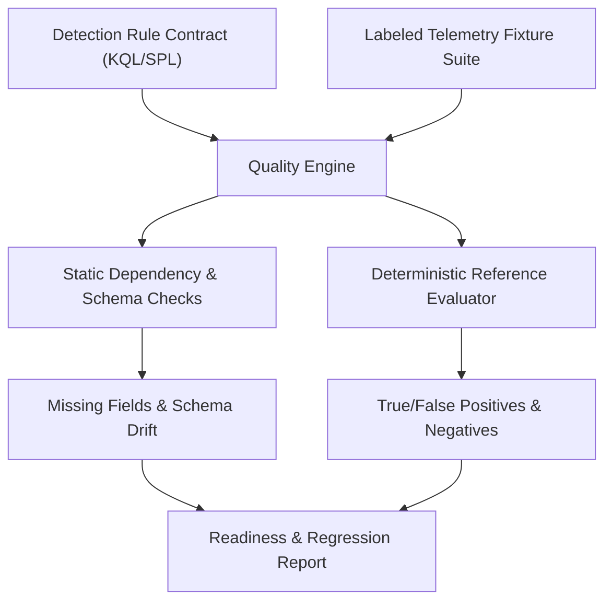

# Detection Quality & Regression Review Workflow

Use this skill to evaluate detection rules written in Microsoft Sentinel KQL and Splunk SPL against labeled telemetry fixtures before deploying them to production SIEM environments.

## Architecture and Core Principles



### Key Review Principles

1. **Explicit Data Dependencies**:
   Every detection rule declares required vs. optional fields, source tables/indexes, and join scopes. If a required field is dropped in an upstream logging pipeline, the workbench detects schema drift immediately.

2. **Labeled Fixture Quality Metrics**:
   - **True Positive (TP)**: Target attack events correctly caught.
   - **False Positive (FP)**: Benign baseline events incorrectly matched (causes alert fatigue).
   - **True Negative (TN)**: Normal operational telemetry safely ignored.
   - **False Negative (FN)**: Target attacks missed due to overly strict filters or missing joins.

> [!IMPORTANT]
> **Precision and recall are measured strictly on labeled test fixtures.** They provide regression baselines and identify filter bugs, but do not prove production scheduled alert firing rates.

## Quick Execution

### Validate Rule Definitions Against Schema

```bash
python3 plugins/detection-hunting/detection-quality-workbench/detectionquality/cli.py validate \
  --rules-dir plugins/detection-hunting/detection-quality-workbench/rules
```

### Evaluate a Single Rule Against Fixtures

```bash
python3 plugins/detection-hunting/detection-quality-workbench/detectionquality/cli.py evaluate \
  --rule plugins/detection-hunting/detection-quality-workbench/rules/RULE-KQL-ENTRA-ANOMALOUS-SIGNIN.json \
  --fixtures plugins/detection-hunting/detection-quality-workbench/fixtures/RULE-KQL-ENTRA-ANOMALOUS-SIGNIN.json
```

### Run the Full Quality Test Suite

```bash
python3 plugins/detection-hunting/detection-quality-workbench/detectionquality/cli.py test-suite \
  --rules-dir plugins/detection-hunting/detection-quality-workbench/rules \
  --fixtures-dir plugins/detection-hunting/detection-quality-workbench/fixtures
```
