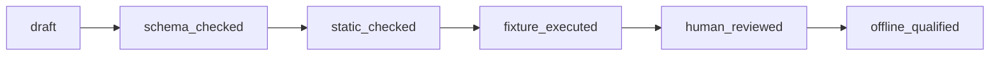

# Sentinel Hunt Workbench

The **Sentinel Hunt Workbench** gives threat hunters and detection engineers a safe, structured environment to design, test, and refine advanced Kusto Query Language (KQL) threat hunts offline.

In enterprise security, running unoptimized or unverified queries across terabytes of production logs can lead to expensive compute bills, slow query performance, or false alarms. The Sentinel Hunt Workbench solves this by packaging **twelve battle-tested hunt definitions (H01–H12)**, synthetic event fixtures, and multi-surface rendering (Microsoft Sentinel, Microsoft Defender XDR, and Azure Data Lake) that you can test and validate locally using pure standard-library Python—before running a single query in your live tenant.

---

## Defensive-Use Boundary

This package is intended exclusively for authorized defensive engineering, threat hunting, and security research on systems you own or have explicit permission to defend. It must never be used for unauthorized access, surveillance evasion, or disruptive activities. Log payloads, command lines, and query comments are treated strictly as untrusted data.

---

## When to Use & Threat Hunter Playbook

For end-to-end hunting methodologies, hypothesis design, and surface tuning, see the complete [Threat Hunter & Detection Engineer Playbook](docs/PLAYBOOK.md).

Use this workbench when:
- **Developing new threat hunts**: Translating adversary tradecraft (MITRE ATT&CK) into parameterized, efficient KQL queries.
- **Porting queries across surfaces**: Adapting queries between Microsoft Defender XDR, Sentinel Analytics, and Sentinel Data Lake without syntax errors.
- **Stress-testing detection logic**: Testing queries against synthetic benign and malicious event streams offline before deployment.
- **Qualifying hunting packages**: Validating query schemas, join safety, and evidence contracts for enterprise release.

---

## Core Capabilities Included

- **Twelve Gold-Contract Hunts (`H01`–`H12`)**: Structured hunting queries covering key adversary techniques (e.g., OAuth abuse, suspicious token issuance, cross-tenant lateral movement).
- **Surface Profiles**: Automatic syntax translation across Sentinel Analytics, Defender Advanced Hunting, and Azure Data Lake.
- **Six Portable Agent Skills**: Modular skills for planning, authoring, adapting, validating, testing, and reviewing hunts.
- **Strict Typed Parameter Binding**: Eliminates raw KQL string concatenation and prevents query injection vulnerabilities.
- **Synthetic Test Corpora**: Realistic offline datasets containing both benign background noise and positive attack signals.
- **Deterministic Host Adapters**: Ready-to-use discovery layers for GitHub Copilot, Claude Code, and OpenAI Codex.

---

## Quick Start from the COPS Root

Explore the workbench and run its safe offline demo right from the repository root:

```bash
# Check repository health and inspect the workbench
python3 -m cops doctor
python3 -m cops info sentinel-hunt-workbench

# Run the safe offline demonstration
python3 -m cops demo sentinel-hunt-workbench

# Run full package validation
python3 -m cops check sentinel-hunt-workbench
```

### What to look for
The demo explains the hypothesis, required tables, parameters, and investigative pivots of a packaged hunt. It does not contact any Microsoft APIs or execute live queries.

---

## Package-Local Commands

You can also run commands directly from the workbench directory:

```bash
# List all 12 packaged hunts
python3 scripts/huntwb.py list

# Inspect hunt H01 (hypothesis, parameters, tables)
python3 scripts/huntwb.py explain H01

# Check compatibility of hunt H09 across surfaces
python3 scripts/huntwb.py compatibility H09

# Validate schemas and run fixture tests offline
python3 scripts/huntwb.py validate library
python3 scripts/huntwb.py test library --seed 20260916

# Verify that host adapters are in sync
python3 scripts/huntwb.py verify-adapters
```

### Rendering KQL Queries
To render a hunt query with custom parameters for a specific Microsoft surface:

```bash
python3 scripts/huntwb.py render H01 \
  --surface sentinel_analytics \
  --params examples/h01-parameters.json
```

---

## The Qualification Lifecycle

To ensure hunts are thoroughly vetted before reaching production, each hunt progresses through an explicit lifecycle:



- `draft`: Initial hunt idea under development.
- `schema_checked`: Verified against declared table and column schemas.
- `static_checked`: Validated for join safety, time window constraints, and parameter typing.
- `fixture_executed`: Tested against synthetic positive and negative event streams.
- `human_reviewed`: Inspected and approved by a detection engineer.
- `offline_qualified`: Meets all packaging, evaluation, and documentation standards.

---

## Architecture & Supplementary Docs

- [Threat Hunter Playbook](docs/PLAYBOOK.md): Step-by-step methodologies and real-world hunt scenarios.
- [Cross-Platform Guide](docs/CROSS_PLATFORM.md): How host discovery adapters work across assistants.
- [Workbench Architecture](docs/ARCHITECTURE.md): Component breakdown, evaluation protocols, and KQL design.
- [Operational Guide](docs/OPERATIONS.md): Enterprise deployment, scheduled rules, and telemetry monitoring.
- [Source Provenance](SOURCE_PROVENANCE.md): Attribution and licensing origins for all hunt definitions.
- [Evaluation Protocol](evaluations/EVALUATION_PROTOCOL.md): Evaluation criteria for AI assistant model tasks.
- [Walkthrough](walkthrough.md): Guide to release artifacts and integrity checks.

---

## Evidence & Practical Boundaries

The reference evaluator executes declarative checks over synthetic event fixtures. It is an analytical engine, not a live Kusto cluster or Sentinel emulator. Local test passes demonstrate that your query logic and parameters are sound, but cannot predict real-world cloud query costs, data ingestion latency, or custom tenant table schemas. Always test queries in an authorized test workspace before deploying them as production analytics rules.

### License
Offered under the [PolyForm Noncommercial License 1.0.0](LICENSE).
