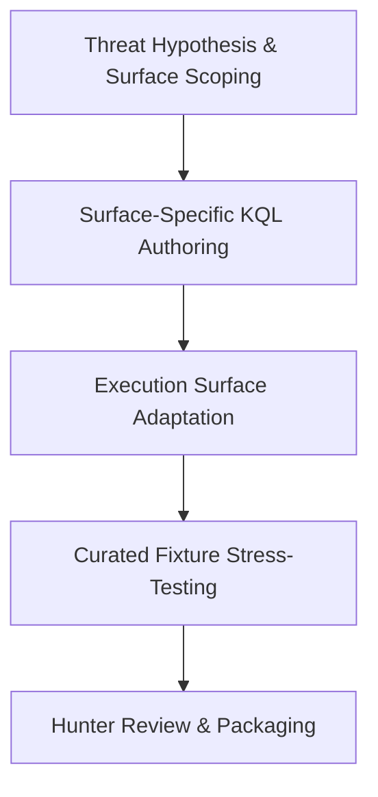

# Sentinel Hunt Workbench Threat Hunter & Detection Engineer Playbook

## 1. Overview & Intended Personas

The **COPS Sentinel Hunt Workbench** is an offline, deterministic development and qualification environment for authoring, adapting, stress-testing, and reviewing defensive threat hunts in Microsoft Sentinel, Defender XDR, and Azure Data Lake.

- **Primary Personas**:
  - **Threat Hunters**: Formulating hypothesis-driven hunts against adversary tactics, techniques, and procedures (MITRE ATT&CK).
  - **Detection Engineers**: Developing robust KQL detection logic with explicit parameterization, project-away safeguards, and performance boundaries.
  - **SIEM / SOC Content Leads**: Qualifying hunting content against synthetic event streams offline before deploying to production workspaces.



---

## 2. When to Use This Plugin

Invoke this workbench under the following concrete triggers:

| Trigger Scenario | Operational Objective | Primary Skills Invoked |
| :--- | :--- | :--- |
| **New Threat Intelligence / ATT&CK Technique** | Author a proactive hunt query targeting newly reported adversary tradecraft. | `plan-sentinel-hunt`, `author-sentinel-kql` |
| **Cross-Surface Query Porting** | Translate an existing hunt between Defender XDR (`DeviceProcessEvents`), Sentinel (`SecurityEvent`), and Data Lake. | `adapt-sentinel-hunt` |
| **Pre-Production Detection Testing** | Stress-test query logic against synthetic benign and malicious fixtures to evaluate false positive propensity. | `test-sentinel-hunt`, `validate-sentinel-hunt` |
| **Offline Hunting Content Qualification** | Verify query syntax, table contracts, and parameters without requiring access to live customer tenants. | `validate-sentinel-hunt`, `review-sentinel-hunt` |

### Operational Boundaries & Safety Guarantees
- **Offline Qualification Only**: The workbench **never connects to live Microsoft APIs**, tenants, or subscription credentials.
- **Assurance Definition**: An `offline_qualified` finding proves that the query parses, conforms to table schemas, executes against synthetic test corpora, and satisfies parameter contracts. It **does not prove** production latency, ingestion cost, or detection efficacy in a live tenant.
- **Defensive Use Mandate**: All hunts must be designed strictly for defensive security operations, incident response, or detection engineering.

---

## 3. Five-Phase Engineering Playbook

### Phase 1: Threat Hypothesis & Surface Scoping
**Skill**: [`plan-sentinel-hunt`](../skills/plan-sentinel-hunt/SKILL.md)

1. **Define Hunting Hypothesis**:
   - State the attacker goal (e.g., adversary abusing OAuth permissions, scheduled task persistence, or LSASS memory dumping).
   - Map technique to MITRE ATT&CK ID (e.g., `T1053.005`, `T1098.005`).
2. **Select Target Execution Surface**:
   - `defender_advanced_hunting`: Endpoint/identity-centric telemetry with 30-day retention.
   - `sentinel_analytics`: Multi-source event correlation with alerting thresholds.
   - `sentinel_data_lake`: High-volume raw telemetry in Azure Data Lake / ADX.
3. **Verify Data Table Requirements**:
   - Confirm required tables (e.g., `SigninLogs`, `AADServicePrincipalSignInLogs`, `SecurityEvent`, `DeviceProcessEvents`).

### Phase 2: Schema-Aware KQL Authoring
**Skill**: [`author-sentinel-kql`](../skills/author-sentinel-kql/SKILL.md)

1. **Implement Mandatory Safeguards**:
   - Include bounded time filters (e.g., `where TimeGenerated between (_StartTime .. _EndTime)`).
   - Use `project` or `project-away` to omit high-overhead unstructured columns.
   - Avoid unbounded `search` or wildcards across entire workspaces.
2. **Parameterize Query**:
   - Externalize configurable thresholds: lookback window, failure count threshold, known-good IP allowlists.

### Phase 3: Execution Surface Adaptation
**Skill**: [`adapt-sentinel-hunt`](../skills/adapt-sentinel-hunt/SKILL.md)

1. **Map Cross-Surface Schema Differences**:
   - Defender `DeviceId` $\leftrightarrow$ Sentinel `Computer` / `_ResourceId`.
   - Defender `AccountUpn` $\leftrightarrow$ Sentinel `TargetUserName` / `UserPrincipalName`.
2. **Adjust Operators for Engine Nuances**:
   - Handle case-sensitivity nuances (`=~` vs `==`).
   - Translate nested JSON unpacks (`parse_json()` vs Defender native bag-unpacking).

### Phase 4: Curated Fixture Stress-Testing & Validation
**Skills**: [`test-sentinel-hunt`](../skills/test-sentinel-hunt/SKILL.md), [`validate-sentinel-hunt`](../skills/validate-sentinel-hunt/SKILL.md)

1. **Execute Against Benign Noise Corpora**:
   - Run query against baseline benign fixtures to measure noise and false-positive tendency.
2. **Execute Against Attack Fixtures**:
   - Run query against curated malicious events to verify trigger condition matches expected threat behavior.
3. **Validate Package Consistency**:
   ```bash
   python3 plugins/detection-hunting/sentinel-hunt-workbench/scripts/validate_package.py
   python3 plugins/detection-hunting/sentinel-hunt-workbench/scripts/stress_test.py
   ```

### Phase 5: Hunter Review & Package Release
**Skill**: [`review-sentinel-hunt`](../skills/review-sentinel-hunt/SKILL.md)

1. **Author Hunter Triage Guidance**:
   - Document step-by-step triage actions when a hit is generated.
   - Identify common false-positive drivers (e.g., vulnerability scanners, administrative batch jobs).
2. **Build Release Artifacts**:
   - Compile release summary with evidence receipts:
     ```bash
     python3 plugins/detection-hunting/sentinel-hunt-workbench/scripts/build_release_artifacts.py
     ```
3. **Document Evidence Limits**:
   - Explicitly note in release notes that offline pass does not guarantee production performance or live tenant telemetry availability.

---

## 4. Verification & Gate Checks

Execute the standard validation path before releasing content:

```bash
# Full offline package check
python3 plugins/detection-hunting/sentinel-hunt-workbench/scripts/validate_package.py

# Offline unit tests
python3 -m unittest discover -s plugins/detection-hunting/sentinel-hunt-workbench/tests -v
```
