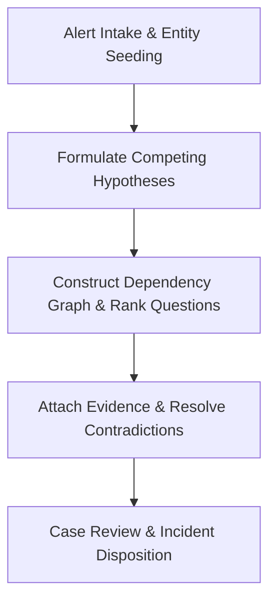

# SOC Investigation Workbench Analyst Playbook

## 1. Overview & Intended Personas

The **COPS SOC Investigation Workbench** provides a structured, evidence-backed reasoning framework for Security Operations Center (SOC) analysts and incident responders. It enforces rigorous investigative discipline by modeling competing hypotheses, tracking evidence linkages, maintaining an inquiry dependency graph, and ranking the most dispositive next questions.

- **Primary Personas**:
  - **SOC Tier 2 / Tier 3 Analysts**: Investigating complex alerts that cannot be resolved with simple single-log lookups.
  - **Incident Responders (IR)**: Orchestrating evidence collection, testing rival explanations, and establishing timeline causality.
  - **Security Operations Leads**: Ensuring junior analysts avoid confirmation bias and document justifiable closure decisions.



---

## 2. When to Use This Plugin

Invoke this workbench during active alert triage and incident handling under the following triggers:

| Trigger Scenario | Operational Objective | Primary Skills Invoked |
| :--- | :--- | :--- |
| **High-Impact Multi-Stage Alert** | Triage complex alerts such as anomalous OAuth consent grants, credential theft indicators, or unusual admin elevation. | `soc-investigation-planning` |
| **Ambiguous / High-Noise Alerts** | Formulate explicit rival hypotheses (true attack vs. approved maintenance vs. benign misconfiguration) to counter confirmation bias. | `soc-investigation-planning` |
| **Information Overload & Alert Fatigue** | Determine the most efficient, discriminatory query to run next when facing thousands of raw logs. | `soc-investigation-planning` |
| **Incident Review & Shift Handoff** | Document the complete chain of evidence, question dependencies, and remaining uncertainties for peer review or escalation. | `soc-investigation-review` |

### Operational Boundaries & Safety Guarantees
- **Investigative Reasoning Only**: The workbench is an analytical decision-support tool. It **does not directly query live SIEMs** or automatically trigger SOAR response actions (e.g., account lock, host isolation).
- **Offline / Local Execution**: Case data and evidence graphs are stored locally as JSON; no tenant credentials or API keys are required.
- **Untrusted Input Caution**: Ingested log messages, filenames, and user input strings are treated strictly as untrusted data, never as executable instructions.

---

## 3. Five-Phase SOC Analyst Playbook

### Phase 1: Case Intake & Entity Seeding
**Skill**: [`soc-investigation-planning`](../skills/soc-investigation-planning/SKILL.md)

1. **Ingest Primary Alert Data**:
   - Record case ID, alert name, severity, timestamp, and reporting detection source.
2. **Seed Known Entities**:
   - Extract identities (User Principal Names, Service Principal IDs, Object IDs).
   - Extract network coordinates (source/destination IP addresses, ASNs, user agents).
   - Extract resource identifiers (hosts, mailboxes, cloud resources).
3. **Initialize Case Record**:
   ```bash
   python3 plugins/detection-hunting/soc-investigation-workbench/scripts/investigate.py plan plugins/detection-hunting/soc-investigation-workbench/examples/case.json
   ```

### Phase 2: Competing Hypothesis Formulation
Avoid fixation on a single premature conclusion by maintaining mutually exclusive explanations:

- **Hypothesis 1 ($H_1$ - Malicious Compromise)**:
  - *Example*: External adversary compromised user credentials via password spray and granted malicious OAuth permissions for persistence.
- **Hypothesis 2 ($H_2$ - Authorized Business Activity)**:
  - *Example*: Approved third-party vendor integration registered by the user following internal change management procedures.
- **Hypothesis 3 ($H_3$ - Benign Misconfiguration / Testing)**:
  - *Example*: Internal developer testing custom automation script in an unauthorized environment.

### Phase 3: Dependency Graph & Question Ranking
**Skill**: [`soc-investigation-planning`](../skills/soc-investigation-planning/SKILL.md)

1. **Identify Critical Missing Inquiries**:
   - What query separates $H_1$ from $H_2$?
   - *Example Questions*:
     - *Q1*: Did the IP address performing the consent grant originate from a known corporate VPN or atypical geographical location?
     - *Q2*: Was an approved Jira/ServiceNow ticket submitted for this application consent?
     - *Q3*: Did the user complete MFA challenge during the session that executed the consent grant?
2. **Evaluate Question Information Gain**:
   - Rank questions based on discriminatory power. Execute inquiries that can decisively refute the highest number of rival hypotheses.

### Phase 4: Evidence Attachment & Contradiction Resolution
1. **Link Gathered Log Evidence**:
   - Associate log excerpts, sign-in records, or ticket confirmations with specific question nodes.
2. **Update Hypothesis Probability**:
   - When evidence proves an authorized change ticket exists, downgrade $H_1$ and upgrade $H_2$.
3. **Document Conflicts & Gaps**:
   - If log retention expired or audit logs are missing, explicitly document an `unavailable_evidence` finding rather than assuming benign behavior.

### Phase 5: Incident Disposition & Review
**Skill**: [`soc-investigation-review`](../skills/soc-investigation-review/SKILL.md)

1. **Finalize Case Disposition**:
   - Classify outcome: `True Positive - Incident`, `True Positive - Benign/Authorized`, or `False Positive - Detection Tuning Required`.
2. **Compile Handoff Artifact**:
   - Export structured case JSON containing the complete hypothesis graph, cited evidence hashes, and remaining uncertainties.
3. **Recommend Containment / Tuning**:
   - If malicious: specify targeted containment (revoke OAuth refresh tokens, disable app).
   - If benign: formulate detection tuning rule to filter out authorized automation.

---

## 4. Verification & Gate Checks

Verify the workbench implementation and example case evaluation:

```bash
# Package validation gate
python3 plugins/detection-hunting/soc-investigation-workbench/scripts/validate-package.py --allow-pending-vendor

# CLI case evaluation smoke test
python3 plugins/detection-hunting/soc-investigation-workbench/scripts/investigate.py plan plugins/detection-hunting/soc-investigation-workbench/examples/case.json
```
