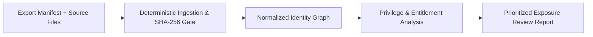

# COPS Entra Identity Workbench

Offline Entra ID, Azure RBAC, and AI Agent identity graph modeling, privilege analysis, and exposure review.

## Overview

The **Entra Identity Workbench** (`entra-identity-workbench`) provides security engineers and identity analysts with an offline, deterministic tool to analyze complex privilege relationships across Microsoft Entra ID (Azure AD), Azure Resource Manager RBAC, and emerging AI Agent identities (such as Microsoft Foundry blueprints and runtime Agent IDs).

Operating entirely from verified, content-hashed export manifests, the workbench models identity relationships without requiring live directory connectivity or cloud credentials. It identifies risky architectural patterns, broad application consents, unmonitored agent privileges, and stale federated trust relationships before they can be leveraged in attack paths.



## Key Capabilities

1. **Explicit Principal Classification**
   - Distinguishes human users (direct members vs. external B2B guests), application registrations, service principals (including legacy Azure AI Foundry service principals), managed identities (user-assigned and system-assigned), declarative agent blueprints, and runtime Agent IDs.
   - Never infers entity types from display names or ad-hoc naming patterns.

2. **Autonomous vs. Delegated Privilege Distinction**
   - Accurately differentiates direct Azure RBAC assignments, inherited group roles, active vs. eligible Privileged Identity Management (PIM) assignments, delegated On-Behalf-Of (OBO) user consents, and autonomous application grants.

3. **AI Agent Privilege Verification**
   - Compares declarative agent blueprints (specifying approved tools, models, and intended read-only access) against instantiated runtime Agent IDs.
   - Detects over-privileged agents where high-risk write or management permissions have been assigned to an agent runtime.

4. **Multi-Tenant Boundary Enforcement**
   - Strictly enforces tenant isolation boundaries.
   - Flags cross-tenant assignments or external federated access without creating spurious multi-tenant reachability paths.

5. **Actionable Review Hypotheses**
   - Outputs review findings categorized by risk, explicitly stating supporting graph edges, missing telemetry required to confirm exploitation, and concrete remediation recommendations.

## Directory Structure

```
entra-identity-workbench/
├── .claude-plugin/plugin.json         # Claude marketplace manifest
├── .codex-plugin/plugin.json          # Codex marketplace manifest
├── org.cops/prerequisites.json # Copilot Studio runtime prerequisites
├── package.json                       # Canonical package descriptor
├── plugin.json                        # Universal plugin manifest
├── README.md                          # Primary overview and usage documentation
├── docs/
│   └── PLAYBOOK.md                    # Step-by-step analyst triage playbook
├── entrawb/                           # Standard-library runtime engine
│   ├── analysis.py                    # Hypothesis evaluation rules
│   ├── cli.py                         # Operator CLI commands
│   ├── graph.py                       # In-memory typed graph builder
│   ├── ingestion.py                   # Manifest & SHA-256 hash validator
│   ├── models.py                      # Frozen dataclasses & error hierarchy
│   └── reporting.py                   # Markdown & JSON report formatters
├── fixtures/                          # Synthetic multi-principal test tenant
│   ├── generate_fixtures.py           # Deterministic fixture generator
│   └── tenants/contoso-corp/          # Tenant export files and manifest
├── schemas/                           # JSON schemas for offline artifacts
│   ├── graph.schema.json              # Normalized graph schema
│   ├── manifest.schema.json           # Ingestion manifest schema
│   └── report.schema.json             # Exposure report schema
├── scripts/
│   ├── run_demo.py                    # Executable offline demo runner
│   └── validate_package.py            # Package integrity gate
├── skills/
│   └── entra-identity-analysis/       # Contributor and agent skill definition
│       └── SKILL.md
└── tests/                             # Automated test suite
    └── test_workbench.py
```

## Quick Start

### 1. Run the Offline Demo

Run the end-to-end demo using the bundled Contoso synthetic tenant fixture:

```bash
python3 plugins/identity-access/entra-identity-workbench/scripts/run_demo.py
```

### 2. Analyze a Tenant Export via CLI

To inspect a tenant export manifest and generate a Markdown review report:

```bash
python3 -m entrawb.cli analyze --manifest plugins/identity-access/entra-identity-workbench/fixtures/tenants/contoso-corp/manifest.json
```

To export structured JSON for automated ingestion into SOC or compliance pipelines:

```bash
python3 -m entrawb.cli analyze --manifest <path/to/manifest.json> --json --output report.json
```

To export the normalized identity graph:

```bash
python3 -m entrawb.cli graph --manifest <path/to/manifest.json> --output graph.json
```

## Limitations & Boundary Rules

- **Offline Analysis Only**: The workbench analyzes offline exports. It does not initiate network calls to Microsoft Graph or Azure Resource Manager.
- **Entitlement Potential vs. Exploitation**: Identified graph paths represent structural privilege reachability. They indicate exposure potential, not confirmed compromise.
- **Strict Evidence Integrity**: All exports must include a `manifest.json` with matching SHA-256 hashes. Incomplete or altered exports are rejected rather than assumed safe.
