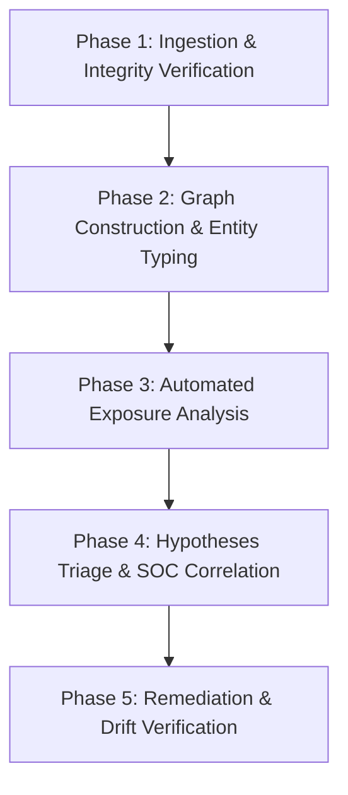

# Analyst Playbook: Entra ID & AI Agent Exposure Review

This playbook guides security analysts, IAM administrators, and cloud engineers through evaluating privilege exposures, unmonitored AI agents, and over-permissioned service principals using the **Entra Identity Workbench**.

---

## 1. Objectives & Overview

Modern cloud environments combine traditional human directory accounts with automated workloads, machine identities, and autonomous AI agents. As organizations deploy AI agent frameworks (such as Microsoft Foundry or custom orchestration runtimes), agents often acquire persistent service credentials or direct Azure RBAC privileges that exceed their intended operational scope.

The Entra Identity Workbench enables you to perform deterministic, offline evaluations of these relationships. By modeling identity graphs from verified tenant exports, analysts can uncover privilege escalations, unowned principals, and risky cross-tenant trusts before adversaries can exploit them.

---

## 2. Investigation Workflow



### Phase 1: Ingestion & Integrity Verification

1. **Verify Export Manifest**:
   Ensure the export bundle contains a valid `manifest.json` following schema `entra.export-manifest/v1`.
2. **Execute Ingestion**:
   ```bash
   python3 -m entrawb.cli analyze --manifest path/to/tenant-export/manifest.json
   ```
3. **Verify Checksums**:
   The engine computes SHA-256 digests for each constituent data file (users, groups, apps, service principals, managed identities, federated credentials, agent blueprints, agent identities, resources, directory roles, role assignments, and OAuth grants). If any checksum fails or a file is missing, the tool halts immediately with an explicit error.

---

### Phase 2: Graph Construction & Entity Typing

The workbench ingests all entities and classifies them strictly according to verified schema properties:

| Principal Type | Key Identifiers | Typical Exposure Surface |
| :--- | :--- | :--- |
| **Human User** | `is_guest: false/true`, UPN | Direct or inherited directory administrator roles, inactive accounts |
| **Service Principal** | App ID, `service_principal_type` | Unowned enterprise apps, legacy Foundry automation credentials |
| **Managed Identity** | `identity_type` (User vs. System Assigned) | High-privilege RBAC roles assigned to compute workloads |
| **Agent Blueprint** | Declared tools, models, intended privilege | Declarative specification drift against runtime entitlements |
| **Agent Identity** | Linked blueprint, runtime sponsor | Over-privileged execution tokens operating autonomously |

---

### Phase 3: Automated Exposure Analysis

The workbench evaluates the normalized graph across six critical exposure patterns:

1. **Broad Application Consent (`broad_app_consent`)**
   - *Pattern*: Application holds high-risk permissions such as `Directory.AccessAsUser.All` or `RoleManagement.ReadWrite.Directory`.
   - *Risk*: Allows autonomous identity takeover or tenant-wide administrative escalation without user interaction.

2. **Ownerless Principals (`ownerless_principal`)**
   - *Pattern*: Applications or service principals with active role assignments or API permissions that have zero registered owners.
   - *Risk*: Orphaned automation objects are prime targets for persistence and credential hijacking.

3. **Stale or Wildcard Federated Trust (`stale_federated_trust`)**
   - *Pattern*: Workload Identity Federation (OIDC) configured with wildcard subjects (e.g., `repo:contoso/*:*`).
   - *Risk*: Any branch or unauthorized workflow run in the external CI/CD provider can exchange tokens for Azure credentials.

4. **Privileged Managed Identities (`privileged_managed_identity`)**
   - *Pattern*: User-assigned or system-assigned managed identities holding `Owner`, `Contributor`, or `Key Vault Administrator` roles.
   - *Risk*: SSRF or workload compromise yields instantaneous lateral movement into critical cloud assets.

5. **AI Agent Privilege Mismatch (`agent_privilege_mismatch`)**
   - *Pattern*: Agent blueprint specifies `read_only` or `low` privilege, but the runtime `Agent ID` holds `Contributor` or `Global Administrator`.
   - *Risk*: Autonomous agent tools can write, modify, or exfiltrate sensitive data outside their approved operational boundaries.

6. **Cross-Tenant Exposure (`cross_tenant_exposure`)**
   - *Pattern*: External guest accounts or cross-tenant principals assigned local privileged directory roles.
   - *Risk*: Compromise of external tenant credentials propagates administrative impact into the local tenant.

---

### Phase 4: Hypothesis Triage & SOC Correlation

Because graph relationships prove structural reachability rather than confirmed exploitation, correlate each finding with active telemetry:

1. **Check Sign-In Telemetry**:
   - Query Microsoft Entra `SignInLogs` and `ServicePrincipalSignInLogs` for the affected principal ID.
   - Verify whether authentication originates from expected IP ranges or managed infrastructure.
2. **Review Audit Logs**:
   - Inspect `AuditLogs` for recent credential additions, consent grants, or role assignment modifications.
3. **Inspect Agent Tool Calls**:
   - For flagged Agent Identities, examine agent runtime execution logs to determine whether high-privilege tools were actually invoked.

---

### Phase 5: Hardening & Remediation

Follow least-privilege remediation steps based on the hypothesis findings:

- **For Over-Privileged Agents**: Revoke tenant or resource role assignments. Align permissions directly with the tools declared in the agent blueprint.
- **For Wildcard Federated Credentials**: Restrict the `subject` claim to a specific repository, branch, or production environment tag.
- **For Ownerless Principals**: Identify the current application custodian and assign verified owners. If abandoned, revoke credentials and disable the principal.
- **For High-Risk App Grants**: Replace broad autonomous permissions (`Directory.AccessAsUser.All`) with scoped, least-privilege API permissions.

---

## 3. Review Checklist

Before signing off on an Entra Identity exposure assessment:

- [ ] All source file hashes match the manifest digests exactly.
- [ ] No entities have been classified based on heuristic naming patterns.
- [ ] Group inheritance chains are resolved transitively.
- [ ] Active and eligible PIM assignments are clearly distinguished.
- [ ] Cross-tenant boundary isolations have been verified.
- [ ] Every flagged critical hypothesis has a designated IAM or engineering owner.
