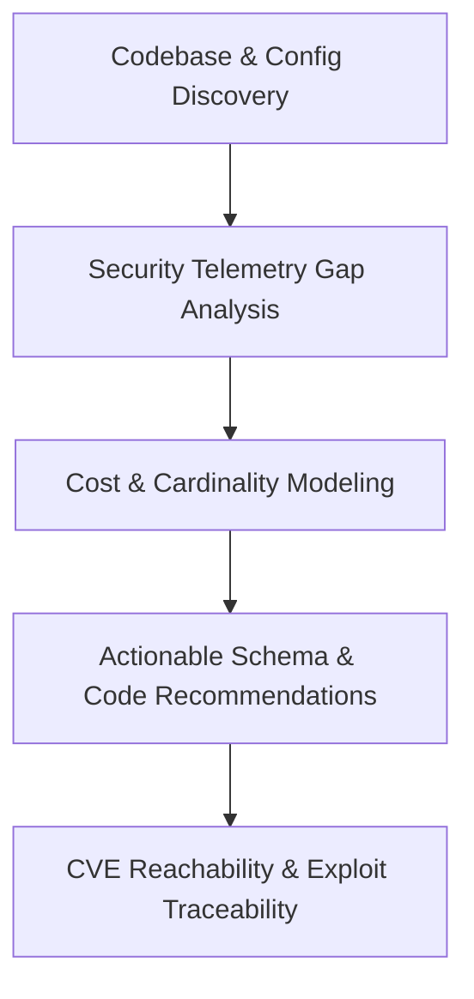

# Security Logging Advisor Analyst & Engineer Playbook

## 1. Overview & Intended Personas

The **COPS Security Logging Advisor** provides structured, cost-aware guidance for designing, implementing, and validating security telemetry in software repositories. 

- **Primary Personas**:
  - **Application Security (AppSec) Engineers**: Ensuring services emit forensic-grade audit trails for identity, data access, and administrative actions.
  - **Detection & Telemetry Engineers**: Standardizing log schemas across heterogeneous microservices for SIEM/data-lake ingestion.
  - **DevSecOps / Software Engineers**: Implementing structured JSON logging frameworks (e.g., Pino, structlog, Zap) and eliminating unreviewed plaintext log sinks.



---

## 2. When to Use This Plugin

Invoke this plugin under the following concrete triggers:

| Trigger Scenario | Operational Objective | Primary Skills Invoked |
| :--- | :--- | :--- |
| **New Service Onboarding** | Establish secure structured logging on Day 1 rather than retrofitting after launch. | `repository-context`, `logging-recommendations` |
| **Post-Incident / Post-Mortem Remediation** | Close forensic blind spots identified during incident response (e.g., missing auth failure context or tenant ID). | `repository-context`, `logging-recommendations` |
| **Compliance & Audit Preparation** | Satisfy formal logging mandates (SOC 2 Type II CC6.8, PCI-DSS v4.0 Req 10, ISO 27001 A.12.4, HIPAA §164.312(b)). | `logging-recommendations` |
| **Structured Logging Migration** | Transition legacy unstructured `console.log()` or `print()` statements to queryable JSON formats. | `repository-context`, `logging-recommendations` |
| **Vulnerable Dependency (CVE) Triage** | Determine if a vulnerable third-party package executes in live code paths and whether its invocation is auditable. | `cve-reachability` |

### Operational Boundaries & Anti-Patterns
- **Offline Code Analysis Only**: This plugin inspects local source code, configuration files, and package manifests. It **does not** connect to live log aggregators (e.g., Datadog, Splunk, Sentinel) or ingest live event streams.
- **Privacy & Secret Redaction**: The advisor never extracts or outputs live secrets, authentication tokens, API keys, or raw customer PII. It flags variables that risk leaking sensitive data into logs.

---

## 3. Five-Phase Engineering Playbook

### Phase 1: Repository Context & Framework Discovery
**Skill**: [`repository-context`](../skills/repository-context/SKILL.md)

1. **Scan Project Topology**:
   - Detect project runtime (Node.js/TypeScript, Python, Go, Java).
   - Identify web frameworks (Express, FastAPI, Django, Gin, Spring Boot).
   - Enumerate existing logging libraries (e.g., `pino`, `winston`, `structlog`, `logging`, `zap`, `logback`).
2. **Catalog Sinks & Sensitive Data Paths**:
   - Identify configured outputs: stdout, local files, rotating streams, cloud forwarders.
   - Detect variable identifiers carrying sensitive risk: `password`, `token`, `secret`, `ssn`, `apiKey`, `creditCard`.
3. **Execute Context Collector**:
   ```bash
   python3 plugins/logging-telemetry/security-logging-advisor/skills/repository-context/scripts/collect-repository-context.py
   ```

### Phase 2: Security Telemetry Gap Analysis
Evaluate the repository against five essential security telemetry domains:

1. **Authentication & Session Lifecycle**:
   - Are login successes and failures logged with source IP, user agent, and normalized username?
   - Are password resets, MFA challenges, and token refreshes explicitly tracked?
2. **Authorization & RBAC Decisions**:
   - Are access denials (`403 Forbidden`) captured with the requested resource, action, and acting identity?
   - Are tenant boundary checks logged in multi-tenant architectures?
3. **Sensitive Data & Cryptographic Operations**:
   - Are encryption key access, credential lookups, or certificate updates audited?
   - Are data export or mass-query operations recorded?
4. **Administrative & Configuration Mutations**:
   - Are role assignments, feature flag changes, or webhook modifications logged?
5. **System Exceptions & Security Faults**:
   - Are unhandled exceptions captured with stack traces in non-production, while sanitized for public clients?

### Phase 3: Cost, Volume, and Cardinality Modeling
Prevent logging bill shock and SIEM saturation:

- **Audit Telemetry (Zero-Drop)**: Auth events, privilege changes, admin modifications. High business value, low transaction volume. Retain for 365+ days.
- **Operational Security Telemetry (Sampled/Aggregated)**: API request counts, cache misses, health checks. High volume. Retain in hot storage for 14–30 days.
- **High-Cardinality Fields**: Ensure user IDs, correlation IDs, and transaction IDs are placed in top-level JSON fields rather than concatenated into unstructured message strings.

### Phase 4: Actionable Recommendations & Code Generation
**Skill**: [`logging-recommendations`](../skills/logging-recommendations/SKILL.md)

1. **Formulate Prioritized Recommendations**:
   - Rank findings by severity: `Critical` (unlogged auth failures), `High` (unredacted auth tokens), `Medium` (missing correlation IDs), `Low` (inconsistent timestamp formats).
2. **Draft Framework-Specific Redaction Serializers**:
   - Provide concrete redaction middleware (e.g., Pino `redact: ['req.headers.authorization']`).
3. **Produce Structured Schema Specification**:
   - Output recommended JSON schema for events conforming to ECS (Elastic Common Schema) or OpenTelemetry log conventions.
4. **Export Report**:
   - Write report to `docs/security/logging-recommendations.md`.

### Phase 5: Dependency Reachability & Exploit Traceability
**Skill**: [`cve-reachability`](../skills/cve-reachability/SKILL.md)

1. **Analyze Vulnerable Call Paths**:
   - For flagged CVEs, trace imports and function calls from entry controllers to vulnerable third-party APIs.
2. **Verify Telemetry Around the Call Site**:
   - Check if an invocation of the vulnerable function is preceded or followed by an audit log entry.
3. **Generate Reachability Report**:
   - Classify findings as `Reachable & Unlogged` (highest triage priority), `Reachable & Logged`, or `Unreachable/Dead Code`.
   - Run report generator:
     ```bash
     python3 plugins/logging-telemetry/security-logging-advisor/skills/cve-reachability/scripts/reachability-report.py --input <cve-list.json>
     ```

---

## 4. Verification & Gate Checks

Before handoff, run the package smoke test and validator:

```bash
# Standard library smoke test
python3 -m cops demo security-logging-advisor

# Package validation
python3 plugins/logging-telemetry/security-logging-advisor/scripts/validate-plugin.py
```
