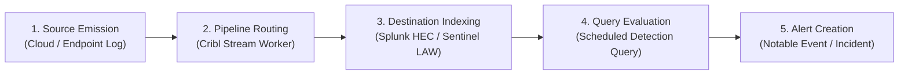

# COPS Telemetry-to-Detection Proof Pack

When a security alert fails to fire, the problem often isn't the detection rule itself. More often, the underlying logs never made it to the SIEM in the first place—silently dropped by an intermediate filter, held up in a pipeline queue, or delivered to the wrong index.

The **Telemetry-to-Detection Proof Pack** solves this problem. It lets detection engineers, pipeline operators, and security analysts trace synthetic test markers step by step through every stage of the logging lifecycle—from source event generation and Cribl Stream routing to destination SIEM indexing (Splunk or Microsoft Sentinel), scheduled search evaluation, and alert creation.

---

## When to Use This Plugin

Use this plugin when you need to:
- **Verify New Ingestion Routes**: Confirm that newly onboarded cloud services or log sources flow cleanly through Cribl Stream into your target SIEM before enabling detections.
- **Diagnose Silent Detection Failures**: Quickly determine whether a missed alert was caused by broken telemetry ingestion (data never arrived) or a detection logic error (data arrived, but the query didn't match).
- **Audit Multi-Tenant Pipelines**: Guard against cross-tenant collisions and ensure customer or environment boundaries are strictly maintained.
- **Provide Audit Evidence**: Generate reproducible, evidence-linked Markdown and JSON reports proving that log pipelines and alert generation work as designed.

---

## The 5 Lifecycle Stages



1. **Source Emission**: Verifies that the source service (such as Microsoft Entra ID or Azure Monitor) emitted the event containing your synthetic test marker (`SYN-...`).
2. **Pipeline Routing**: Verifies that intermediate routing engines (such as Cribl Stream) received the event, applied enrichment pipelines, and routed it downstream without dropping or misrouting it.
3. **Destination Indexing**: Verifies that the event arrived and was indexed in the target storage container (`index=endpoint` in Splunk or `SigninLogs` in Sentinel).
4. **Query Evaluation**: Verifies that the scheduled detection rule executed across the index and returned a positive match for the marker.
5. **Alert Creation**: Verifies that a high-fidelity incident or notable event was created and assigned an alert ID for SOC triage.

---

## Understanding Pipeline Health

The correlation engine summarizes pipeline health into three clear states:

| Health Status | Description | Action Required |
| :--- | :--- | :--- |
| **`healthy`** | All 5 stages observed. The event flowed completely and triggered an alert. | None. Maintain continuous synthetic heartbeat testing. |
| **`degraded`** | Telemetry was indexed in the SIEM, but the detection rule returned 0 matches or failed to alert. | Inspect detection rule queries (KQL/SPL), time ranges, and alert suppression settings. |
| **`broken`** | Telemetry was dropped in Cribl Stream or never reached destination indexing. | Check Cribl route regex filters, receiver health, destination HEC tokens, or workspace credentials. |

---

## Quick Start

### Run the Demo

See healthy, degraded, and broken proof pack traces in action:

```bash
python3 plugins/logging-telemetry/telemetry-proof-pack/scripts/run_demo.py
```

### Trace a Pipeline Run

Generate a human-readable Markdown report from a manifest and evidence directory:

```bash
python3 plugins/logging-telemetry/telemetry-proof-pack/proofpack/cli.py trace \
  --manifest plugins/logging-telemetry/telemetry-proof-pack/fixtures/routes/cribl-splunk-route/manifest.json \
  --evidence-dir plugins/logging-telemetry/telemetry-proof-pack/fixtures/routes/cribl-splunk-route
```

### Validate a Manifest

Check that a run manifest follows the proof pack specification:

```bash
python3 plugins/logging-telemetry/telemetry-proof-pack/proofpack/cli.py validate \
  --manifest plugins/logging-telemetry/telemetry-proof-pack/fixtures/routes/cribl-splunk-route/manifest.json
```

---

## Safety, Privacy & Zero Network Overhead

- **Synthetic Markers Only**: All test traces use non-sensitive identifiers (such as `SYN-SPLUNK-TRACE-101`).
- **Automatic Redaction**: Built-in scrubbing strips tokens, API keys, and passwords while keeping markers intact.
- **Offline Determinism**: No live production network calls or active credentials are used; analysis runs purely on verified evidence artifacts.

For full operational step-by-step procedures, refer to the [Operational Playbook](docs/PLAYBOOK.md).
