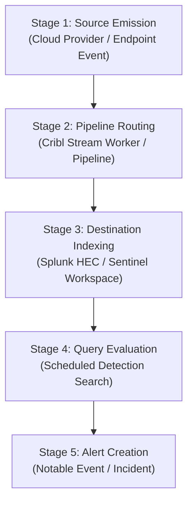

# Detection & Pipeline Engineer Playbook: Telemetry-to-Detection Proof Tracing

This playbook guides detection engineers, pipeline operators, and SIEM administrators through tracing synthetic test markers across data collection, stream routing, SIEM indexing, and detection evaluation using the **Telemetry-to-Detection Proof Pack**.

---

## 1. Objectives & Overview

In modern enterprise security architectures, telemetry rarely travels directly from an endpoint or cloud service into a SIEM. It passes through intermediate routing engines (such as Cribl Stream), transformation pipelines, and regional buffering clusters before arriving in Splunk or Microsoft Sentinel.

When an alert doesn't fire as expected, engineers often waste hours debugging detection queries when the data was never indexed in the first place. Conversely, engineers might assume a logging pipeline is working perfectly when subtle schema changes cause SIEM searches to return zero rows.

The **Telemetry-to-Detection Proof Pack** provides:
- **Deterministic Proof of Ingestion**: Verifies whether an event containing a synthetic marker traversed every hop.
- **Stage Isolation**: Instantly isolates whether a failure occurred at the source, in Cribl routing, during SIEM indexing, or in scheduled search evaluation.
- **Multi-Tenant Protection**: Prevents cross-tenant leaks and accidental cross-environment routing.
- **Audit-Ready Evidence**: Produces tamper-evident proof reports linked by SHA-256 evidence hashes.

---

## 2. The 5-Stage Verification Lifecycle



---

## 3. Step-by-Step Operator Procedures

### Step 1: Define the Run Manifest

Create a `manifest.json` describing the run parameters, target destination, detection rule, and retention policies.

```json
{
  "schema_version": "cops.proof-manifest/v1",
  "run_id": "RUN-SPLUNK-PROVE-01",
  "authorized_environment": "staging-telemetry-cluster",
  "synthetic_marker": "SYN-SPLUNK-TRACE-101",
  "source_event_type": "Microsoft.Entra.UserSignin",
  "pipeline_route": "cribl_to_splunk",
  "destination": {
    "platform": "splunk",
    "target_container": "index=endpoint",
    "tenant_or_workspace_id": "corp-tenant-01"
  },
  "detection_rule": {
    "rule_id": "RULE-SPL-DEFENDER-POWERSHELL-EXEC",
    "rule_name": "Suspicious PowerShell Execution",
    "rule_version": "1.0.0"
  },
  "time_window": {
    "start_time": "2026-10-01T12:00:00Z",
    "end_time": "2026-10-01T13:00:00Z",
    "clock_skew_seconds": 120
  },
  "evidence_capture_policy": {
    "retention_days": 30,
    "redaction_required": true,
    "allowed_stages": [
      "source_emission",
      "pipeline_routing",
      "destination_indexing",
      "query_evaluation",
      "alert_creation"
    ]
  }
}
```

### Step 2: Inject Non-Sensitive Synthetic Markers

- Use standard marker prefixes: `SYN-[PLATFORM]-[PURPOSE]-[ID]`.
- Inject the marker into non-sensitive metadata fields (such as `userPrincipalName`, `description`, or custom attributes).
- **Never include production passwords, live tokens, or private secrets in test events.**

### Step 3: Collect Evidence Files

Place stage logs into a dedicated run directory:
- `source_event.json`: Cloud audit log or endpoint agent record.
- `cribl_route.json`: Cribl worker stream metrics or route access log.
- `destination_indexing.json`: Splunk HEC ingestion record or Sentinel `SigninLogs` query result.
- `query_evaluation.json`: Scheduled search audit record or analytics execution log.
- `alert_creation.json`: Notable event or security incident payload.

### Step 4: Run Multi-Stage Correlation

Execute the proof pack correlation engine:

```bash
python3 plugins/logging-telemetry/telemetry-proof-pack/proofpack/cli.py trace \
  --manifest path/to/manifest.json \
  --evidence-dir path/to/evidence_dir
```

Review the Markdown summary and check the overall status:
- **`HEALTHY`**: Telemetry and detection verified end-to-end.
- **`DEGRADED`**: Data indexed, but detection rule failed to match or alert.
- **`BROKEN`**: Telemetry dropped before reaching destination SIEM.

---

## 4. Troubleshooting Common Failures

### Case A: Degraded Pipeline (Indexed but Detection Missed)

**Symptoms**:
- `destination_indexing` is `OBSERVED`.
- `query_evaluation` is `UNRESOLVED` (`matched_count: 0`) and `alert_creation` is `MISSING`.

**Remediation Steps**:
1. Check the detection query syntax against the raw indexed event in Splunk or Sentinel.
2. Confirm field name casing (e.g. `UserPrincipalName` vs `user_principal_name`).
3. Check the rule lookback window. If data indexing latency exceeded the rule's query interval, the event fell outside the search window.
4. Verify alert throttling and suppression rules. Was an identical alert triggered recently?

---

### Case B: Broken Pipeline (Event Dropped in Stream Routing)

**Symptoms**:
- `source_emission` is `OBSERVED`.
- `pipeline_routing` is `UNRESOLVED` (`status: dropped` or `filtered_out: true`).
- `destination_indexing` is `MISSING`.

**Remediation Steps**:
1. Inspect Cribl Stream pipeline filter conditions and drop regex patterns.
2. Check if a sampling rule or volume-reduction filter unexpectedly matched the event.
3. Review worker group health, outbound backpressure, and destination HEC token validity.

---

### Case C: Cross-Tenant Collision

**Symptoms**:
- `source_emission` is `UNRESOLVED` (`Cross-tenant collision`).

**Remediation Steps**:
1. Verify the source event's tenant ID against the manifest's expected workspace/tenant ID.
2. Check intermediate Cribl routes to ensure cross-tenant traffic isn't merging into a shared pipeline without tenant tagging.
3. Isolate tenant streams using dedicated Cribl worker pipelines or separate HEC tokens.

---

## 5. Audit & Compliance Sign-Off

Before promoting new detection rules or pipeline routes to production:
1. Run `python3 plugins/logging-telemetry/telemetry-proof-pack/scripts/validate_package.py`.
2. Generate a JSON proof report using `--json --output evidence/proof-report.json`.
3. Archive the generated report alongside the detection pull request as proof of end-to-end validation.
