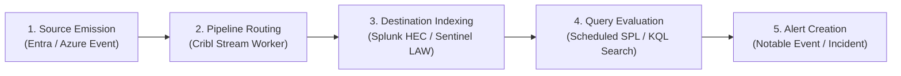

# Telemetry-to-Detection Proof Tracing Workflow

Use this skill to trace synthetic test markers across your entire security logging and detection pipeline—from initial cloud event generation through intermediate stream routing (Cribl Stream) to final SIEM indexing (Splunk or Microsoft Sentinel) and detection rule evaluation.

## Architecture and Pipeline Lifecycle



### Stage Definitions and Classifications

Each lifecycle stage receives one of three clear classifications:
- **`observed`**: The synthetic marker was positively identified in evidence records for this stage with valid timestamp and hash.
- **`missing`**: The synthetic marker was not present in the evidence for this stage (e.g. event dropped upstream, rule search never executed, or alert suppressed).
- **`unresolved`**: The event reached the stage but encountered an error condition, such as a cross-tenant collision, dropped route metric, or 0 query matches.

### Pipeline Health States

- **`healthy`**: All 5 stages are observed end-to-end. Telemetry flowed completely and the detection rule created an alert.
- **`degraded`**: Telemetry was successfully indexed in the destination SIEM table or index, but the detection rule returned 0 matches or failed to trigger an alert.
- **`broken`**: Telemetry was dropped in Cribl Stream or failed to reach destination indexing.

> [!IMPORTANT]
> **Synthetic Markers Only**: All proof pack runs use dedicated non-sensitive markers (e.g. `SYN-SPLUNK-TRACE-101`). Live production secrets and tokens are automatically scrubbed by the built-in redaction engine.

## Operator CLI Commands

### 1. Validate a Run Manifest

Verify the schema and scope parameters of a proof pack manifest:

```bash
python3 plugins/logging-telemetry/telemetry-proof-pack/proofpack/cli.py validate \
  --manifest plugins/logging-telemetry/telemetry-proof-pack/fixtures/routes/cribl-splunk-route/manifest.json
```

### 2. Trace Pipeline Evidence (Markdown Report)

Correlate evidence files against the manifest and output a human-friendly Markdown report:

```bash
python3 plugins/logging-telemetry/telemetry-proof-pack/proofpack/cli.py trace \
  --manifest plugins/logging-telemetry/telemetry-proof-pack/fixtures/routes/cribl-splunk-route/manifest.json \
  --evidence-dir plugins/logging-telemetry/telemetry-proof-pack/fixtures/routes/cribl-splunk-route
```

### 3. Trace Pipeline Evidence (JSON Output)

Generate structured machine-readable JSON for automated CI/CD gating:

```bash
python3 plugins/logging-telemetry/telemetry-proof-pack/proofpack/cli.py trace \
  --manifest plugins/logging-telemetry/telemetry-proof-pack/fixtures/routes/cribl-sentinel-route/manifest.json \
  --evidence-dir plugins/logging-telemetry/telemetry-proof-pack/fixtures/routes/cribl-sentinel-route \
  --json
```
