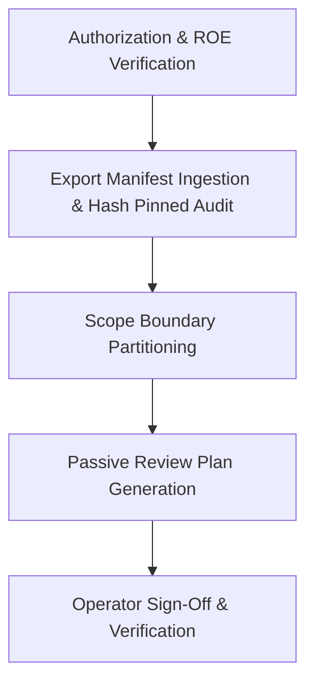

# Attack Surface Planner Offensive Engineer & Red Teamer Playbook

## 1. Overview & Intended Personas

The **COPS Attack Surface Planner** builds passive, offline attack surface review plans from human-approved rules-of-engagement scopes and pinned local export manifests. It enforces rigorous scope discipline, partitions assets into in-scope, excluded, and unresolved buckets, and requires explicit operator sign-off before any active operations.

- **Primary Personas**:
  - **Offensive Security Engineers & Red Teamers**: Scoping authorized security assessments and building structured testing plans against verified enterprise assets.
  - **Penetration Testers**: Ensuring complex multi-tenant environments have strict, auditable boundary controls separating client assets from out-of-scope third parties.
  - **Attack Surface Management (ASM) Analysts**: Reconciling cloud/Entra tenant exports with formal rules-of-engagement contracts.



---

## 2. When to Use This Plugin

Invoke this planner under the following concrete triggers:

| Trigger Scenario | Operational Objective | Primary Skills Invoked |
| :--- | :--- | :--- |
| **Assessment Scoping & Kickoff** | Formalize approved rules of engagement (ROE) and map assets before starting an authorized offensive assessment. | `authorized-attack-surface-planning` |
| **Multi-Tenant Azure/Entra Boundary Review** | Reconcile complex tenant inventories, subscription IDs, and custom domains to prevent testing out-of-scope infrastructure. | `authorized-attack-surface-planning` |
| **Passive Discovery Planning** | Plan non-intrusive observation and reconnaissance methods without making unreviewed network or tenant calls. | `authorized-attack-surface-planning` |
| **Active Network & Service Identification** | Conduct rate-limited, resumable port and TLS identification across approved boundaries. | `network-active-discovery` |
| **Infrastructure & Identity Services Assessment** | Assess protocol exposure (DNS, SNMP, NTP, RPC, LDAP, Kerberos), validate boundaries with canaries, and hand off identity attack paths. | `network-infrastructure-services` |
| **Audit & Engagement Compliance** | Document explicit boundary justifications, excluded scopes, and remaining uncertainties for compliance review. | `authorized-attack-surface-planning` |

### Operational Boundaries & Safety Guarantees
- **Strict Authorization Prerequisite**: Planning requires an explicit, human-signed rules-of-engagement (ROE) document. Authorization is **never inferred** from source code or discovery artifacts.
- **Passive & Offline Execution**: The planner makes **zero network requests** and executes **zero active exploitation**. All planning operates against offline JSON manifests.
- **Fail-Closed Scope Boundaries**: Any asset whose ownership or scope cannot be definitively proven is classified as `unresolved` and excluded from testing.
- **Data Privacy**: Export data and customer resource identifiers are treated as untrusted and confidential data.

---

## 3. Five-Phase Offensive Engineer Playbook

### Phase 1: Authorization & Rules of Engagement Verification
**Skill**: [`authorized-attack-surface-planning`](../skills/authorized-attack-surface-planning/SKILL.md)

1. **Verify Human Authorization**:
   - Confirm existence of signed ROE document specifying start time, end time, emergency contact, and permitted testing methods.
2. **Define Operator & Engagement Metadata**:
   - Record engagement ID, lead assessor, target client name, and authorized communication channels.

### Phase 2: Export Manifest Ingestion & Hash-Pinned Audit
1. **Gather Local Inventory Exports**:
   - Collect offline JSON exports of target cloud resources, domains, IP ranges, or Entra tenant objects.
2. **Record SHA-256 Checksums**:
   - Pin every input file with a cryptographic hash to ensure the review plan is auditable and repeatable.
3. **Execute Ingestion CLI**:
   ```bash
   python3 plugins/offensive-security/attack-surface-planner/scripts/plan.py <path-to-scope.json>
   ```

### Phase 2b: Multi-Source Telemetry Normalization & Scope Quarantine
**Skill**: [`network-passive-discovery`](../skills/network-passive-discovery/SKILL.md)

1. **Normalize Telemetry**:
   - Ingest raw DNS, certificate, IP allocation, endpoint, and cloud export records using `python3 -m cops discovery normalize <file> --type <type>`.
2. **Deduplicate Multi-Source Observations**:
   - Merge overlapping observations while retaining full cryptographic provenance chains: `python3 -m cops discovery merge <inv1> <inv2> ...`.
3. **Reconcile Scope Quarantine**:
   - Reconcile discoveries against engagement boundaries: `python3 -m cops discovery reconcile <inventory.json> --scope <scope.json>`.
   - Quarantine assets exhibiting conflicting ownership, stale records, or missing provenance so discovery cannot expand the engagement.

### Phase 2c: Bounded Active Discovery & Service Identification
**Skill**: [`network-active-discovery`](../skills/network-active-discovery/SKILL.md)

1. **Plan Authorized Assessment**:
   - Configure approved targets, ports, protocol, and TLS assessment with explicit vantage and rate limits: `python3 -m cops discovery active plan ...`.
2. **Execute Resumable Probes**:
   - Execute bounded probes with checkpointing: `python3 -m cops discovery active scan ...`.
   - Resuming skips completed probes without repeating side effects: `python3 -m cops discovery active resume ...`.
3. **Calibrate Fingerprint Uncertainty**:
   - Distinguish observed configurations from inferred fingerprints with explicit confidence and visible uncertainty reasons.
4. **Enforce Boundary & DNS Rebind Defense**:
   - Detect dynamic DNS changes or out-of-scope shifts; halt probes and quarantine immediately.
5. **Verify Remediated Exposures**:
   - Evaluate remediation delta between baseline and re-test sessions: `python3 -m cops discovery active diff ...`.

### Phase 2d: Infrastructure & Identity Services Assessment
**Skill**: [`network-infrastructure-services`](../skills/network-infrastructure-services/SKILL.md)

1. **Protocol-Specific Infrastructure Probing**:
   - Assess exposure of DNS, mDNS, SNMP, NTP, RPC endpoint mapper, LDAP, and Kerberos across approved targets: `python3 -m cops discovery infrastructure assess ...`.
2. **Strict Inaccessible != Secure Grounding**:
   - Unreachable, timed out, or connection-refused services are strictly classified as `inaccessible` (with `auth_prerequisite: unknown`). Never assume an inaccessible service is secure or hardened.
3. **Canary Records and Controlled Identities**:
   - Use benign canary domain queries (`canary.corp.internal`) and synthetic account names (`canary-user@CORP.INTERNAL`) to validate access barriers non-destructively.
4. **Extract Identity Attack-Path Candidates**:
   - Extract candidate attack paths (`ldap_anonymous_reconnaissance`, `asrep_roasting`, `rpc_endpoint_enumeration`, `snmp_credential_leak`, `open_dns_recursion`, `ntp_mode6_amplification`) for Active Directory and lateral movement specialist handoff: `python3 -m cops discovery infrastructure candidates ...`.

### Phase 2e: Remote Administration, File Sharing, and Printing Services Assessment
**Skill**: [`network-remote-and-file-services`](../skills/network-remote-and-file-services/SKILL.md)

1. **Protocol-Specific Remote, File, and Printing Probing**:
   - Assess exposure of remote administration (SSH, Telnet, RDP, VNC, WinRM, X11), file sharing (SMB, NFS, FTP/TFTP, rsync, AFP), and printing services (LPD, IPP, Raw/JetDirect) across approved targets: `python3 -m cops remote-services assess ...`.
2. **Strict Inaccessible != Secure Grounding**:
   - Filtered, closed, or timed out services are strictly classified as `inaccessible` (with `auth_prerequisite: unknown`). Never report an inaccessible service as secure or hardened.
3. **Canary Validation and Verifiable Cleanup Receipts**:
   - Validate access controls and write boundaries using benign canary files or synthetic print jobs.
   - Emit verified `CleanupReceipt` records confirming rollback and artifact removal: `python3 -m cops remote-services cleanup ...`.
4. **Extract Host Privilege Candidates**:
   - Extract candidate attack paths (`smb_v1_enabled`, `smb_signing_disabled`, `smb_unauthenticated_share`, `telnet_plaintext_exposure`, `rdp_nla_disabled`, `vnc_no_auth`, `winrm_http_unencrypted`, `x11_open_display`, `nfs_no_root_squash`, `ftp_anonymous_login`, `rsync_open_module`, `unauthenticated_printer_queue`) for offensive and lateral movement specialist handoff: `python3 -m cops remote-services candidates ...`.

### Phase 3: Scope Boundary Partitioning
Systematically classify every discovered entity into one of three strict partitions:

1. **In-Scope (`in_scope`)**:
   - Explicitly listed in the signed ROE, verified to belong to target client ownership.
2. **Excluded (`excluded`)**:
   - Explicitly forbidden: shared third-party SaaS, production payment processors, emergency response infrastructure, partner tenants.
3. **Unresolved (`unresolved`)**:
   - Assets with ambiguous ownership, disputed DNS records, or shared multi-tenant endpoints. Fail-closed: marked as untestable until confirmed in writing.

### Phase 4: Passive Review Plan Generation
For each in-scope asset, author a passive, bounded evaluation step:

- **Target Identifier**: FQDN, tenant ID, or IP range.
- **Observation Technique**: Passive DNS historical lookup, Certificate Transparency log inspection, public header review.
- **Expected Telemetry**: What logs should the client's SOC observe?
- **Stop Condition**: Immediate halt condition if sensitive customer data or system degradation is detected.
- **Cleanup & Rollback**: Confirm no persistence or residual artifacts remain.

### Phase 5: Operator Review & Plan Sign-Off
1. **Review Boundary Report**:
   - Verify summary counts: in-scope, excluded, and unresolved assets.
2. **Present Plan to Client / Engagement Lead**:
   - Walk through proposed passive observation steps. Confirm written sign-off before initiating any separate execution phase.
3. **Export Engagement Record**:
   - Archive plan JSON alongside the signed ROE.

---

## 4. Verification & Gate Checks

Validate the package implementation and test reproducibility:

```bash
# Package validation gate
python3 plugins/offensive-security/attack-surface-planner/scripts/validate-package.py

# Offline unit tests
python3 -m unittest discover -s plugins/offensive-security/attack-surface-planner/tests -v
```
