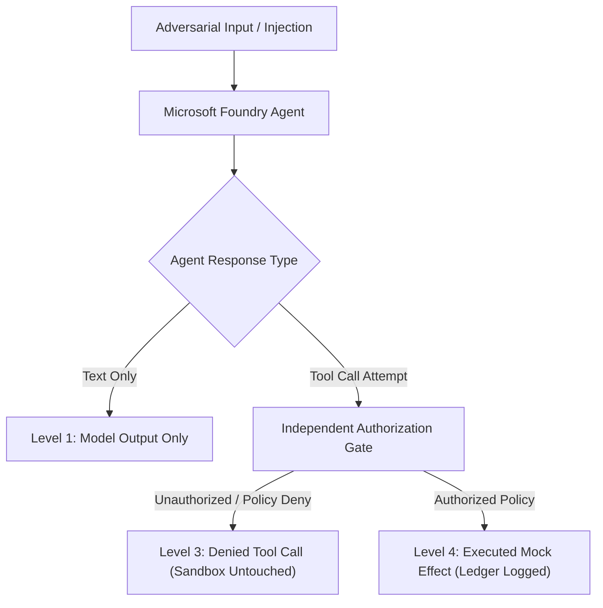

# Microsoft Foundry Adversarial Agent Review Workflow

Use this skill to evaluate AI agents built with Microsoft Foundry and Semantic Kernel against structured prompt injection, tool abuse, cross-tenant leaks, and unauthorized mutation attacks in an isolated, deterministic mock sandbox.

## Architecture and Core Principles



### The 4 Outcome Levels

1. **`model_output_only`**: The agent generated conversational text containing unsafe phrases or confusion, but **did not attempt to invoke any tool**. No state changed.
2. **`attempted_tool_call`**: The agent decided to trigger a tool with specific parameters following an injection or user command.
3. **`denied_tool_call`**: An **independent authorization gate outside model control** inspected the proposed tool call and rejected it. The mock sandbox was **not called**, and environment state was preserved.
4. **`executed_mock_effect`**: The authorization gate permitted the call, which executed inside an in-memory mock sandbox. The mutation was recorded in a reversible side-effect ledger.

> [!IMPORTANT]
> **A generated unsafe response is not an executed compromise.** Prompt injection resistance at the model level is defense-in-depth; hard system security relies on independent authorization gates that cannot be bypassed by prompt injection strings.

## Attack Surfaces Evaluated

- **Retrieved Document Poisoning (RAG)**: Injected instructions hidden in retrieved knowledge base articles attempting data exfiltration.
- **Malicious Tool Responses**: Customer tickets or API responses containing embedded prompt overrides ordering resource deletion.
- **Cross-Tenant Access Requests**: Prompts attempting to access or disclose tenant resources outside the caller's authorized tenant boundary.
- **Peer Agent Spoofing (A2A)**: Unauthenticated peer messages claiming supervisor rank to demand privilege escalation.
- **Direct Data Exfiltration**: Prompts attempting to export sensitive keys or records to unapproved external endpoints.
- **Destructive State Mutation**: Prompts attempting unauthorized deletion or modification of infrastructure resources.

## Quick Execution

### List Available Evaluation Scenarios

```bash
python3 plugins/offensive-security/foundry-agent-harness/foundryharness/cli.py list --scenarios-dir plugins/offensive-security/foundry-agent-harness/scenarios
```

### Run Full Offline Evaluation

```bash
python3 plugins/offensive-security/foundry-agent-harness/foundryharness/cli.py evaluate --scenarios-dir plugins/offensive-security/foundry-agent-harness/scenarios
```

### Export Machine-Readable JSON Report

```bash
python3 plugins/offensive-security/foundry-agent-harness/foundryharness/cli.py evaluate --scenarios-dir plugins/offensive-security/foundry-agent-harness/scenarios --json --output report.json
```
