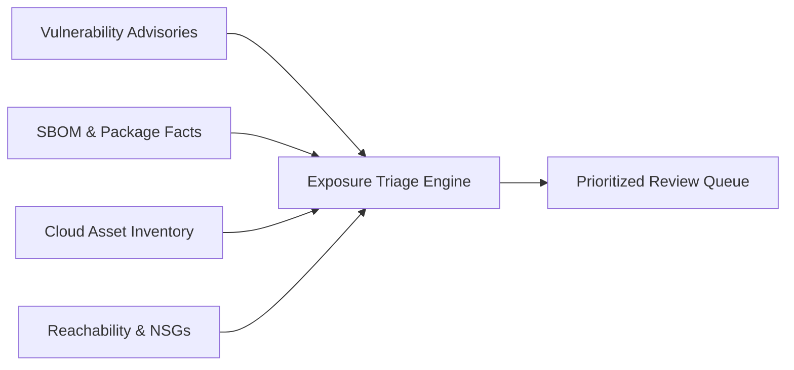

# COPS Exposure Triage Workbench

Evidence-backed vulnerability triage and exposure prioritization engine.

## Overview

The **Exposure Triage Workbench** (`exposure-triage-workbench`) equips security analysts, AppSec engineers, and vulnerability managers with an evidence-backed workflow to triage vulnerabilities using real-world exposure rather than raw CVSS scores alone.

In typical cloud environments, vulnerability scanners flood triage backlogs with thousands of "Critical" and "High" alerts. However, a CVSS 10.0 vulnerability inside an isolated, non-routed backend database presents a radically different operational risk than a CVSS 8.0 flaw on an internet-facing payment gateway.

The Exposure Triage Workbench reconciles:
- **Advisory Specs**: CVE identifiers, affected version criteria, CVSS base scores, and CISA Known Exploited Vulnerabilities (KEV) status.
- **Component & SBOM Evidence**: Exact installed packages, direct vs. transitive dependency origins, install file paths, and SHA-256 hashes.
- **Cloud Asset Inventories**: Authoritative cloud resource IDs, subscription boundaries, workload criticality, and registered service owners.
- **Reachability & Routing Proof**: Inbound network security rules, private endpoints, firewall policies, and Attack Path Workbench traversal edges.



## Key Capabilities

1. **Contextual Exposure Prioritization**
   - Ranks alerts into five transparent tiers (**P1 Critical**, **P2 High**, **P3 Medium**, **P4 Low**, and **Investigation Required**) based on explicit factors: version confirmation, asset criticality, network ingress, and evidence age.
   - Operates with deterministic, rule-based logic—never opaque, non-deterministic scoring models.

2. **Authoritative Identity Matching**
   - Strictly joins components and network reachability to assets via unique resource IDs and subscription scopes.
   - Never joins records on ambiguous display names, ensuring identical workload names across production and development environments remain strictly separated.

3. **Explicit Handling of Unknowns & Contradictions**
   - Packages with unknown version strings or ambiguous build provenance are explicitly flagged for investigation rather than guessed.
   - Detects contradictory evidence (e.g. an asset reported as internet-exposed while network security group rules block external access) and assigns an explicit investigation action.

4. **Actionable Analyst Playbooks**
   - Emits concrete, role-based next steps for every finding (e.g., emergency patch vs. network isolation vs. package verification vs. backlog archiving).

## Directory Structure

```
exposure-triage-workbench/
├── .claude-plugin/plugin.json         # Claude marketplace manifest
├── .codex-plugin/plugin.json          # Codex marketplace manifest
├── com.sodejm.copse/prerequisites.json # Copilot Studio runtime prerequisites
├── package.json                       # Canonical package descriptor
├── plugin.json                        # Universal plugin manifest
├── README.md                          # Primary overview and usage documentation
├── docs/
│   └── PLAYBOOK.md                    # Step-by-step analyst triage playbook
├── exposuretriage/                    # Standard-library runtime engine
│   ├── cli.py                         # Operator CLI commands
│   ├── evaluator.py                   # Transparent prioritization rules
│   ├── ingestion.py                   # Multi-source JSON bundle parser
│   ├── models.py                      # Frozen dataclasses & error hierarchy
│   └── reporting.py                   # Markdown & JSON report formatters
├── fixtures/                          # Synthetic multi-asset test bundle
│   ├── generate_fixtures.py           # Deterministic fixture generator
│   └── bundles/synthetic-enterprise/  # Multi-source test bundle JSON
├── schemas/                           # JSON schemas for offline artifacts
│   ├── triage-input.schema.json       # Input bundle schema
│   └── triage-report.schema.json      # Exposure report schema
├── scripts/
│   ├── run_demo.py                    # Executable offline demo runner
│   └── validate_package.py            # Package integrity gate
├── skills/
│   └── exposure-triage/               # Contributor and agent skill definition
│       └── SKILL.md
└── tests/                             # Automated test suite
    └── test_workbench.py
```

## Quick Start

### 1. Run the Offline Demo

Run the end-to-end triage evaluation against the synthetic enterprise bundle:

```bash
python3 plugins/vulnerability-management/exposure-triage-workbench/scripts/run_demo.py
```

### 2. Triage an Evidence Bundle via CLI

To inspect a multi-source bundle and generate a Markdown review report:

```bash
python3 -m exposuretriage.cli triage --input plugins/vulnerability-management/exposure-triage-workbench/fixtures/bundles/synthetic-enterprise/bundle.json
```

To export structured JSON for automated ingestion into ticketing or SIEM systems:

```bash
python3 -m exposuretriage.cli triage --input <path/to/bundle.json> --json --output triage-report.json
```

To validate bundle syntax without running prioritization:

```bash
python3 -m exposuretriage.cli validate --input <path/to/bundle.json>
```

## Limitations & Operational Boundaries

- **Offline Analysis Only**: The workbench evaluates provided evidence bundles offline. It does not perform active network port scans, remote vulnerability probes, or exploit execution.
- **Entitlement & Exposure Potential**: Priority tiers evaluate reachability and entitlement potential. They do not prove active attacker exploitation or remote code execution.
- **Evidence Freshness Gate**: Stale asset inventory snapshots (>30 days old) are highlighted as uncertain.
