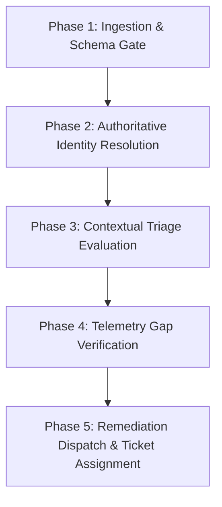

# Analyst Playbook: Evidence-Backed Vulnerability & Exposure Triage

This playbook guides security analysts, AppSec engineers, and vulnerability management leads through triaging vulnerability alerts using the **Exposure Triage Workbench**.

---

## 1. Objectives & Background

Ranking vulnerabilities strictly by CVSS base scores causes fatigue and misallocated remediation effort. An unauthenticated remote code execution flaw in an internal, non-routable batch job rarely demands a midnight incident response call, whereas a medium-severity flaw in a public-facing web portal may represent immediate risk.

The Exposure Triage Workbench replaces one-dimensional CVSS ranking with a **multi-dimensional evidence evaluation**:
1. Does the asset run a version that is confirmed vulnerable?
2. Is the workload reachable from the public internet or high-risk lateral paths?
3. What is the business criticality of the hosting asset?
4. Are compensating network controls (e.g. firewalls or WAFs) active and verified?

---

## 2. Investigation Workflow



### Phase 1: Ingestion & Schema Gate

1. **Verify Evidence Bundle**:
   Ensure the input bundle contains valid `advisories`, `assets`, `components`, and `reachability` records matching schema `cops.exposure-triage-input/v1`.
2. **Execute Ingestion**:
   ```bash
   python3 -m exposuretriage.cli triage --input path/to/triage-bundle.json
   ```
3. **Verify Field Integrity**:
   Every record must include required identifiers. Missing or corrupted entries will cause the tool to halt immediately with an explicit error.

---

### Phase 2: Authoritative Identity Resolution

Vulnerability matching must never rely on display names alone. The engine resolves relationships using unique, fully-qualified resource IDs:

- **Cross-Subscription Separation**: Identically named assets (such as `app-service-frontend` in production vs. development) are evaluated as separate workload instances.
- **Component Association**: Software components are bound to specific asset IDs, ensuring libraries deployed across multiple servers are evaluated within their respective network contexts.

---

### Phase 3: Priority Tiers Explained

| Tier | Criteria | Typical Scenarios | Recommended Analyst Response |
| :--- | :--- | :--- | :--- |
| **P1 (Critical)** | Confirmed vulnerable version + public internet route + crown jewel or high-criticality asset | Internet-facing payment gateway or customer login API running unpatched Log4j or RCE library | Immediate incident escalation; verify ingress blocking and dispatch emergency patch. |
| **P2 (High)** | Confirmed vulnerable version + public route on standard asset OR internal route on crown jewel | Internal database with crown jewel data holding vulnerable component; public static app | Prioritized patch within 7 days; review lateral network access. |
| **P3 (Medium)** | Confirmed vulnerable version + internal lateral route only | Internal batch worker or development pipeline component | Remediate in next scheduled sprint/maintenance window. |
| **P4 (Low)** | Confirmed unaffected/patched version OR air-gapped/isolated workload | Component updated past vulnerable range; offline reporting VM | Close ticket; maintain automated dependency monitoring. |
| **Investigation Required** | Unknown component version OR contradictory reachability evidence | Package detected without version metadata; asset marked public but firewall drops traffic | Dispatch discovery action: verify binary version or audit firewall routing. |

---

### Phase 4: Resolving Complex Edge Cases

#### 1. Unknown or Ambiguous Installed Versions
- **Symptom**: Item flagged as `UNKNOWN_INVESTIGATION_REQUIRED` with note: *"exact installed version is unknown"*.
- **Investigation Steps**:
  1. Inspect the workload's build pipeline, Dockerfile, or lockfile (`package-lock.json`, `poetry.lock`, `pom.xml`).
  2. Query host package managers (`dpkg -l`, `rpm -qa`) or file hashes to establish exact release.
  3. Re-run triage with the verified version string.

#### 2. Contradictory Reachability Evidence
- **Symptom**: Item flagged as `UNKNOWN_INVESTIGATION_REQUIRED` with note: *"Asset inventory reports public internet exposure, but network reachability controls assert traffic is blocked"*.
- **Investigation Steps**:
  1. Verify whether the public IP has an effective network security rule allowing inbound connections.
  2. Inspect Azure Network Watcher or AWS VPC Flow Logs to check for actual incoming external packets.
  3. Update the reachability fact to reflect effective configuration.

#### 3. Stale Asset Inventory Records
- **Symptom**: Finding marked with uncertainty: *"Asset inventory timestamp exceeds freshness threshold (>30d)"*.
- **Investigation Steps**:
  1. Verify if the asset has been decommissioned or re-imaged.
  2. Trigger a fresh Cloud Asset Inventory / Azure Resource Graph export before making architectural decisions.

---

### Phase 5: Action Dispatch & Review Checklist

Before signing off on an exposure triage review:

- [ ] Every P1 item has an assigned engineering owner and an open remediation ticket.
- [ ] No items have been deprioritized based on assumed rather than evidenced compensating controls.
- [ ] All `UNKNOWN_INVESTIGATION_REQUIRED` findings have been assigned for technical verification.
- [ ] Invariant holds: Production and development assets with identical names have distinct tickets.
- [ ] Clean machine-readable JSON export generated and archived with audit trail.
