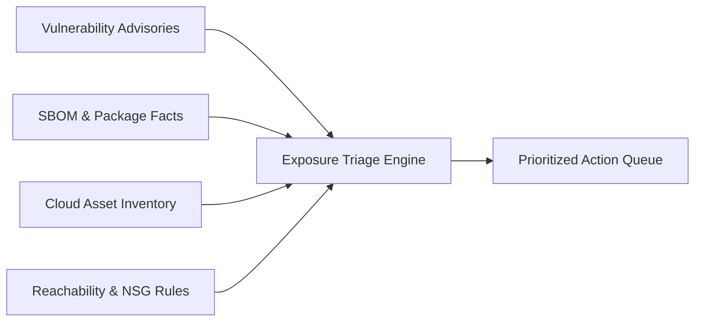

# Exposure Triage Workflow

Use this skill to evaluate and prioritize vulnerability alerts using multi-source evidence rather than relying solely on raw CVSS scores.

## Workflow Overview



1. **Ingest Verified Facts**:
   Combine vulnerability advisory specs (CVE IDs, vulnerable version clauses, CVSS), local asset inventories (subscriptions, resource types, owners, criticality), package component manifests (installed versions, file paths, SHA-256 hashes), and network reachability records (public routes, internal endpoints, NSG rules).

2. **Evaluate Contextual Exposure**:
   - Compare installed versions against advisory ranges to distinguish `confirmed_vulnerable`, `confirmed_unaffected`, and `unknown_version`.
   - Reconcile network route boundaries to distinguish `public_internet`, `internal_lateral`, `isolated`, and `contradictory`.
   - Inspect inventory timestamps to flag stale evidence (>30 days).

3. **Generate Actionable Triage Queue**:
   Rank items into transparent priority tiers:
   - **P1 (Critical)**: Confirmed vulnerable version on public-facing crown jewel or high-criticality assets.
   - **P2 (High)**: Confirmed vulnerable version on public-facing standard assets or internal crown jewel assets.
   - **P3 (Medium)**: Confirmed vulnerable version on internal lateral assets.
   - **P4 (Low)**: Confirmed unaffected/patched versions or isolated environments.
   - **Investigation Required**: Items with unknown installed versions or contradictory reachability evidence.

## Quick Execution

### Run Triage on an Input Bundle

```bash
python3 -m exposuretriage.cli triage --input path/to/triage-bundle.json
```

### Export Machine-Readable JSON

```bash
python3 -m exposuretriage.cli triage --input path/to/triage-bundle.json --json --output triage-report.json
```

### Validate Input Bundle Structure

```bash
python3 -m exposuretriage.cli validate --input path/to/triage-bundle.json
```
